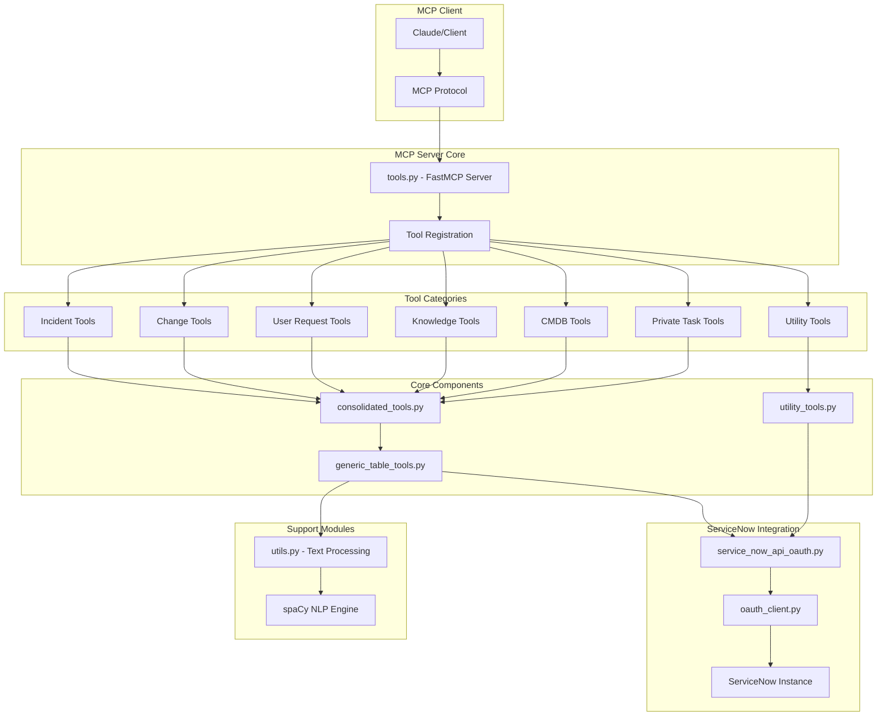

# MCP Server Architecture Overview

This diagram shows the high-level architecture of the Personal MCP ServiceNow server, illustrating how components interact from the MCP client down to the ServiceNow API.

## Key Components

- **MCP Client**: External clients (like Claude) communicating via MCP protocol
- **FastMCP Server**: Core server handling tool registration and routing
- **Tool Categories**: 25+ tools organized by ServiceNow table type (snake_case compliant)
- **Generic Layer**: Reusable functions to minimize code duplication
- **OAuth 2.0 Only**: Exclusive OAuth authentication with automatic token management
- **NLP Processing**: spaCy-powered text analysis for similarity matching

## Code Quality Features

- **SonarCloud Compliant**: All cognitive complexity violations resolved (≤15 limit)
- **PEP 8 Standards**: Complete snake_case naming convention adherence
- **Modular Architecture**: Helper functions improve maintainability and testability
- **Low Complexity**: API functions refactored from complexity 20 to ≤8
- **Enhanced Readability**: Single responsibility principle applied throughout