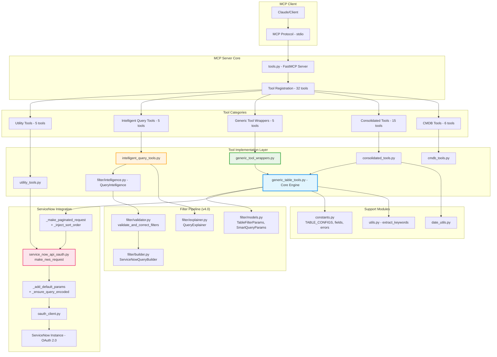

# MCP Server Architecture Overview (v3.0)

This diagram shows the architecture of the Personal MCP ServiceNow server after the v3.0 consolidation: 5 generic tools replace 24 per-table wrappers, centralized URL encoding, performance parameters, and deterministic pagination.

```mermaid
graph TB
    subgraph "MCP Client"
        A[Claude/Client] --> B[MCP Protocol - stdio]
    end

    subgraph "MCP Server Core"
        B --> C[tools.py - FastMCP Server]
        C --> D[Tool Registration - 32 tools]
    end

    subgraph "Tool Categories"
        D --> E[Utility Tools - 5 tools]
        D --> F[Intelligent Query Tools - 5 tools]
        D --> G[Generic Tool Wrappers - 5 tools]
        D --> H[Consolidated Tools - 15 tools]
        D --> I[CMDB Tools - 6 tools]
    end

    subgraph "Tool Implementation Layer"
        E --> L[utility_tools.py]
        F --> AI[intelligent_query_tools.py]
        G --> GW[generic_tool_wrappers.py]
        H --> CT[consolidated_tools.py]
        I --> CMDB[cmdb_tools.py]

        AI --> NLP[filter/intelligence.py - QueryIntelligence]
        GW --> GTT[generic_table_tools.py - Core Engine]
        CT --> GTT
    end

    subgraph "Filter Pipeline (v4.0)"
        NLP --> FV[filter/validator.py<br/>validate_and_correct_filters]
        FV --> FB[filter/builder.py<br/>ServiceNowQueryBuilder]
        AI --> FEXP[filter/explainer.py<br/>QueryExplainer]
        GTT --> FMOD[filter/models.py<br/>TableFilterParams, SmartQueryParams]
    end

    subgraph "ServiceNow Integration"
        GTT --> PAG[_make_paginated_request<br/>+ _inject_sort_order]
        PAG --> API[service_now_api_oauth.py<br/>make_nws_request]
        L --> API
        API --> PERF[_add_default_params<br/>+ _ensure_query_encoded]
        PERF --> OAUTH[oauth_client.py]
        OAUTH --> SN[ServiceNow Instance - OAuth 2.0]
    end

    subgraph "Support Modules"
        GTT --> CONST[constants.py<br/>TABLE_CONFIGS, fields, errors]
        GTT --> UTILS[utils.py - extract_keywords]
        CT --> DATE[date_utils.py]
    end

    style GW fill:#e8f5e8,stroke:#4caf50,stroke-width:3px
    style GTT fill:#e1f5fe,stroke:#2196f3,stroke-width:3px
    style AI fill:#fff3e0,stroke:#ff9800,stroke-width:2px
    style API fill:#fce4ec,stroke:#e91e63,stroke-width:2px
```

## Architecture Components

### Core Infrastructure
- **MCP Client**: External clients (Claude) communicating via MCP protocol over stdio
- **FastMCP Server**: Tool registration and routing for 32 tools
- **Generic Tool Wrappers**: 5 parameterized tools replace 24 per-table wrappers

### Tool Layer
- **generic_tool_wrappers.py** (v3.0): `search_records`, `get_record`, `get_record_summary`, `find_similar`, `filter_records` — each takes a `table` parameter and validates against `TABLE_CONFIGS`
- **consolidated_tools.py**: Priority incidents (date logic), knowledge tools (category filtering), 5 SLA tools (preset dispatcher: `query_slas_by_status`, `query_slas_custom`, `query_slas_by_task`, `get_sla_details`, `similar_slas_for_text`)
- **intelligent_query_tools.py**: NLP-based query processing with confidence scoring
- **cmdb_tools.py**: 6 CMDB tools with 100+ CI table types

### ServiceNow Integration (v3.0 enhancements)
- **`make_nws_request()`**: Central HTTP function for all read queries
  - `_add_default_params()`: Injects `sysparm_display_value=true`, `sysparm_exclude_reference_link=true`, `sysparm_no_count=true`
  - `_ensure_query_encoded()`: Centralized URL encoding for `sysparm_query` values
- **`_make_paginated_request()`**: Offset-based pagination with `_inject_sort_order()` appending `^ORDERBYDESCsys_created_on` by default
- **oauth_client.py**: OAuth 2.0 client credentials flow, auto-refresh on 401

### Configuration
- **constants.py**: `TABLE_CONFIGS` (8 tables), `ESSENTIAL_FIELDS`, `DETAIL_FIELDS`, error messages, priority values

### Filter Pipeline (v4.0 Sprint 1)
- **filter/builder.py**: `ServiceNowQueryBuilder` — static OR / date-range / exclusion / complete-filter constructors
- **filter/validator.py**: `validate_query_filters`, per-field validators, `validate_and_correct_filters` (auto-correction owns the only intelligence → builder bridge), `debug_query_construction`
- **filter/intelligence.py**: `QueryIntelligence` — regex-based NL → filter conversion. Does not import builder.
- **filter/explainer.py**: `QueryExplainer` — human-readable explanation + result-size estimation
- **filter/models.py**: `TableFilterParams`, `SmartQueryParams` (Pydantic) and `QueryValidationResult` container
- **query_validation.py / query_intelligence.py**: backwards-compat shims, deleted in v4.1

## v4.0 Changes (in progress)

### Sprint 2 — SLA tool collapse (shipped)
- 10 SLA tools → 5 via `query_slas_by_status` preset dispatcher + `query_slas_custom` escape hatch
- Tool count: 37 → 32
- Bug fix: `get_sla_details(sys_id)` now routes via `sys_id={sys_id}` (v3 routed via `number={sys_id}` against a table with no `number` field, returning 10K-row dumps)
- Offline token-footprint regression suite: `tests/test_token_footprint.py`

### Sprint 1 — Filter pipeline consolidation (in progress)
- `query_validation.py` + `query_intelligence.py` + `TableFilterParams`/`SmartQueryParams` from `generic_table_tools.py` collapsed into `filter/` package
- Auto-correction logic moved from intelligence to validator → no backref `intelligence → builder`
- Old modules retained as shims, deleted in v4.1

### Sprint 3 — OAuth + HTTP split (planned)
- Split `ServiceNowOAuthClient` into TokenStore + AuthHeaderProvider + RequestExecutor
- Split `make_nws_request` into `http_layer/` (url_builder + response_parser + request_dispatcher)

## v3.0 Changes

### Files Added
- `Table_Tools/generic_tool_wrappers.py` — 5 generic MCP-facing tools

### Files Enhanced
- `service_now_api_oauth.py` — performance params + URL encoding
- `generic_table_tools.py` — deterministic sort order for pagination
- `consolidated_tools.py` — removed 24 wrappers, kept unique logic
- `vtb_task_tools.py` — PUT to PATCH, removed dead code

### Key Metrics (v3.0)
- 37 tools (down from 55)
- 537 tests passing, 80% coverage
- All functions under CC 15

## Key Metrics (v4.0, current)
- 32 tools
- 562 tests passing, 82.44% coverage
- `filter/` package coverage: 98.16%

## Tool Inventory (32 tools — v4.0)

| # | Tool | Source |
|---|------|--------|
| 1-5 | `search_records`, `get_record_summary`, `get_record`, `find_similar`, `filter_records` | generic_tool_wrappers.py |
| 6 | `get_priority_incidents` | consolidated_tools.py |
| 7-9 | `similar_knowledge_for_text`, `get_knowledge_by_category`, `get_active_knowledge_articles` | consolidated_tools.py |
| 10-11 | `create_private_task`, `update_private_task` | vtb_task_tools.py |
| 12-21 | 10 SLA tools | consolidated_tools.py |
| 22-27 | 6 CMDB tools | cmdb_tools.py |
| 28-32 | 5 intelligent query tools | intelligent_query_tools.py |
| 33-37 | 5 auth/utility tools | utility_tools.py, table_tools.py |
