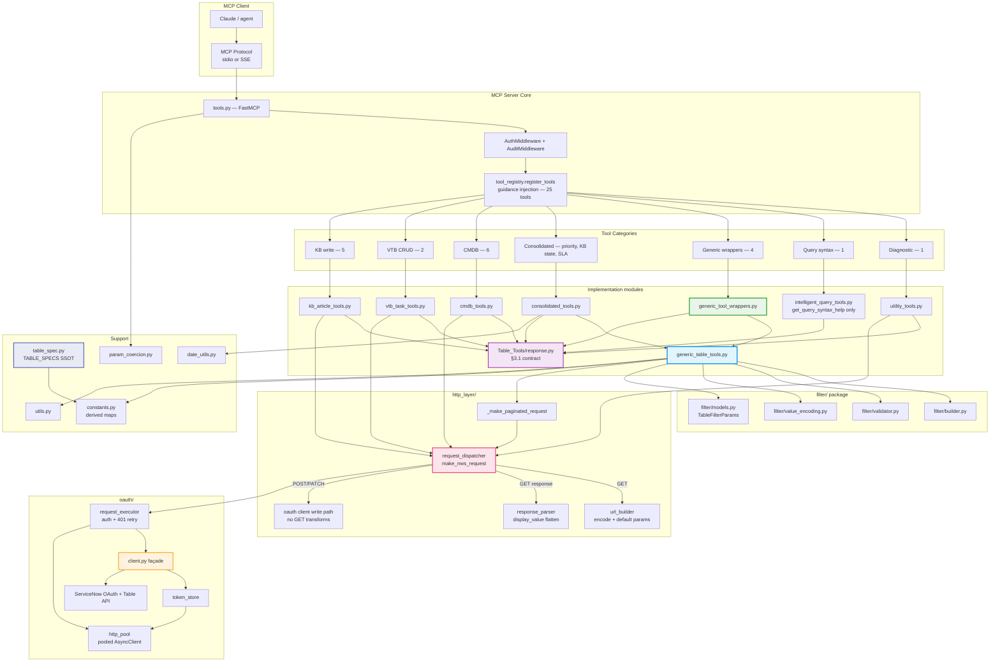

# MCP Server Architecture Overview (v5.0)

Layered view of the Personal MCP ServiceNow server after the v3 generic-tool consolidation, the v4 package splits (`filter/`, `http_layer/`, `oauth/`), and the v5.0 "Boron" surface cull: **25 tools**, no in-repo NL engine, §3.1 response contract, `table_spec` SSOT, and guidance-injected registration.

```mermaid
graph TB
    subgraph "MCP Client"
        A[Claude / agent] --> B[MCP Protocol<br/>stdio or SSE]
    end

    subgraph "MCP Server Core"
        B --> C[tools.py — FastMCP]
        C --> MW[AuthMiddleware + AuditMiddleware]
        MW --> REG[tool_registry.register_tools<br/>guidance injection — 25 tools]
    end

    subgraph "Tool Categories"
        REG --> E[Diagnostic — 1]
        REG --> F[Query syntax — 1]
        REG --> G[Generic wrappers — 4]
        REG --> H[Consolidated — priority, KB state, SLA]
        REG --> I[CMDB — 6]
        REG --> J[VTB CRUD — 2]
        REG --> K[KB write — 5]
    end

    subgraph "Implementation modules"
        E --> L[utility_tools.py]
        F --> IQ[intelligent_query_tools.py<br/>get_query_syntax_help only]
        G --> GW[generic_tool_wrappers.py]
        H --> CT[consolidated_tools.py]
        I --> CMDB[cmdb_tools.py]
        J --> VTB[vtb_task_tools.py]
        K --> KB[kb_article_tools.py]
        GW --> GTT[generic_table_tools.py]
        CT --> GTT
        GW --> RESP[Table_Tools/response.py<br/>§3.1 contract]
        CT --> RESP
        VTB --> RESP
        KB --> RESP
        CMDB --> RESP
        L --> RESP
        IQ --> RESP
    end

    subgraph "filter/ package"
        GTT --> FB[filter/builder.py]
        GTT --> FV[filter/validator.py]
        GTT --> FVE[filter/value_encoding.py]
        GTT --> FMOD[filter/models.py<br/>TableFilterParams]
    end

    subgraph "http_layer/"
        GTT --> PAG[_make_paginated_request]
        PAG --> DISP[request_dispatcher<br/>make_nws_request]
        VTB --> DISP
        KB --> DISP
        L --> DISP
        CMDB --> DISP
        DISP -->|GET| URL[url_builder<br/>encode + default params]
        DISP -->|GET response| RPAR[response_parser<br/>display_value flatten]
        DISP -->|POST/PATCH| WRITE[oauth client write path<br/>no GET transforms]
    end

    subgraph "oauth/"
        DISP --> EXEC[request_executor<br/>auth + 401 retry]
        EXEC --> CLI[client.py façade]
        CLI --> TOK[token_store]
        EXEC --> POOL[http_pool<br/>pooled AsyncClient]
        TOK --> POOL
        CLI --> SN[ServiceNow OAuth + Table API]
    end

    subgraph "Support"
        SPEC[table_spec.py<br/>TABLE_SPECS SSOT]
        SPEC --> CONST[constants.py<br/>derived maps]
        GTT --> CONST
        GTT --> UTILS[utils.py]
        CT --> DATE[date_utils.py]
        C --> COERCE[param_coercion.py]
    end

    style GW fill:#e8f5e8,stroke:#4caf50,stroke-width:3px
    style GTT fill:#e1f5fe,stroke:#2196f3,stroke-width:3px
    style DISP fill:#fce4ec,stroke:#e91e63,stroke-width:2px
    style CLI fill:#fff3e0,stroke:#ff9800,stroke-width:2px
    style RESP fill:#f3e5f5,stroke:#9c27b0,stroke-width:2px
    style SPEC fill:#e8eaf6,stroke:#3f51b5,stroke-width:2px
```

## Architecture components

### Core
- **Transport**: stdio (Claude Desktop / MCPB) or SSE (`MCP_TRANSPORT=sse`, Docker)
- **FastMCP** in `tools.py`: registers **25** tools via `tool_registry.register_tools` (mandatory WHEN / WHEN-NOT / PREFER guidance injected into each docstring above `Args:`)
- **`AuthMiddleware`** (SSE bearer) then **`AuditMiddleware`** (structured JSON logs to stderr)
- **`param_coercion`**: stringified JSON dict params coerced at the tool boundary

### Tool layer
| Module | Role |
|--------|------|
| `generic_tool_wrappers.py` | 4 table-parameterized tools; validates `table` against `TABLE_CONFIGS` |
| `consolidated_tools.py` | Priority incidents, `get_kb_articles_by_state`, 4 SLA tools |
| `vtb_task_tools.py` | `create_private_task` / `update_private_task` (PATCH) |
| `kb_article_tools.py` | Update, publish, batch publish, retire, duplicate check |
| `cmdb_tools.py` | 6 CMDB tools; concurrent CI table probes on detail lookup |
| `intelligent_query_tools.py` | `get_query_syntax_help` only (encoded-query operator reference) |
| `utility_tools.py` | `health_check(probe_table=None)` — single diagnostic |

### SSOT + registration (v5.0)
- **`table_spec.py`**: one `TableSpec` per table; `constants.py` derives `TABLE_CONFIGS`, `ESSENTIAL_FIELDS`, `DETAIL_FIELDS`, `TABLE_ERROR_MESSAGES`, and identity/text-search maps from it
- **`tool_registry.py`**: `TOOL_GUIDANCE` + `register_tools()` — selection guidance is structured data, not free-form prose in each file
- **`Table_Tools/response.py`**: `error_response` / `list_response` / `record_response` — §3.1 contract constructors used by every tool

### `filter/` (v4.0 Sprint 1; NL modules removed v5.0)
- **builder**: `ServiceNowQueryBuilder` — OR / date-range / exclusion constructors
- **validator**: validate + `validate_and_correct_filters` + result-count / pagination helpers
- **value_encoding** (v4.4.1): `encode_query_value` — per-value escaping; refuses `^` in operand values
- **models**: `TableFilterParams`, `QueryValidationResult`
- **Removed in v5.0**: `filter/intelligence.py`, `filter/explainer.py` (in-repo NL engine; host model does NL → filter)

### `http_layer/` (v4.0 Sprint 3)
- **`make_nws_request`**: GET applies `ensure_query_encoded` + `add_default_params` + `extract_display_values`
- **Writes (POST/PATCH/DELETE)**: bypass all three — locked by negative tests in `tests/test_http_layer.py`
- **Default GET params**: `sysparm_display_value=true`, `sysparm_exclude_reference_link=true`, `sysparm_no_count=true`
- **Pagination**: `_make_paginated_request` + deterministic `^ORDERBYDESCsys_created_on` unless an ORDERBY already exists
- **Read-failure contract** (v4.4): failed GET raises `ServiceNowRequestError` (never `None` for failure)

### `oauth/` (v4.0 Sprint 3 + v4.2 pool)
- **singleton** (`oauth/singleton.py`): process-wide client + `make_oauth_request`
- **client**: façade over TokenStore + RequestExecutor
- **token_store**: cache + refresh buffer before expiry
- **request_executor**: authenticated HTTP + single 401 → refresh → retry
- **http_pool** (v4.2): shared keep-alive `httpx.AsyncClient`
- **exceptions**: OAuth / Authentication / Connection / Authorization

### Configuration
- `table_spec.py` → `constants.py` derived maps (tables, fields, error strings)
- Env vars or `~/.config/mcp-servicenow/config.json` via `config_loader.py`

## Response contract (§3.1)

| Shape | Envelope |
|-------|----------|
| List success | `{result, returned_count, truncated}` |
| Single record | `{record}` (`record` may be `null` for a miss) |
| Write success | `{record, message}` |
| Failure | `{error: {code, message}}` — codes: `VALIDATION` \| `NOT_FOUND` \| `AUTH` \| `FORBIDDEN` \| `TIMEOUT` \| `HTTP` \| `INTERNAL` |
| Partial page | collected rows + `{partial: true, error}` (only sanctioned data+error coexist) |

Presence of `error` is the discriminator. No bare strings; no `{"message": ...}` success dialect.

## Supported tables

| Table | Prefix / notes |
|-------|----------------|
| `incident` | INC |
| `change_request` | CHG |
| `sc_req_item` | RITM |
| `sc_task` | SCTASK |
| `universal_request` | UR |
| `kb_knowledge` | KB; no priority field |
| `vtb_task` | VTB; only table with generic-path CRUD tools |
| `task_sla` | stage instead of state; no number prefix (`number_field` structural in `TableSpec`) |

## Tool inventory (25 tools — v5.0 "Boron")

| # | Tools | Source |
|---|--------|--------|
| 1 | `health_check` | utility_tools |
| 2–5 | `search_records`, `get_record`, `find_similar`, `filter_records` | generic_tool_wrappers |
| 6 | `get_priority_incidents` | consolidated_tools |
| 7 | `get_kb_articles_by_state` | consolidated_tools |
| 8–9 | `create_private_task`, `update_private_task` | vtb_task_tools |
| 10–14 | `update_knowledge_article`, `publish_knowledge_article`, `publish_knowledge_articles`, `retire_knowledge_article`, `check_kb_duplicates` | kb_article_tools |
| 15–18 | `get_sla_details`, `query_slas_by_task`, `query_slas_by_status`, `query_slas_custom` | consolidated_tools |
| 19–24 | `find_cis_by_type`, `search_cis_by_attributes`, `get_ci_details`, `similar_cis_for_ci`, `get_all_ci_types`, `quick_ci_search` | cmdb_tools |
| 25 | `get_query_syntax_help` | intelligent_query_tools |

## Version lineage (short)

| Release | What changed |
|---------|----------------|
| **v3** | 5 generic tools replace 24 wrappers; perf params + encoding + ORDERBY pagination |
| **v4.0** | SLA collapse (10→5); `filter/`, `http_layer/`, `oauth/` packages; shims temporary |
| **v4.1** | Shims deleted; KB write tools + `get_kb_articles_by_state`; `get_query_syntax_help`; `filter_records` truncation metadata |
| **v4.2** | Pooled httpx; single OR-combined LIKE text search; CMDB concurrency / encoding |
| **v4.3** | Claude Desktop `.mcpb` packaging (no Nuitka release path) |
| **v4.4** | Read-failure raise contract; encoded-query value boundary (`^` refuse, `&` left transport safe-set) |
| **v5.0** | 39→25 tool cull; NL engine deleted; §3.1 response contract; `table_spec` + `tool_registry` |

## Key invariants

1. **GET** always applies encode + default sysparm + display-value flatten.
2. **Write methods** never apply those GET transforms.
3. **Failed GET raises** `ServiceNowRequestError` — never returns `None` to mean failure.
4. **Value encoding**: producer safe-set is transport's minus `^`; `&` is not safe in the transport.
5. **Stdout** is reserved for MCP JSON-RPC; logs and prints go to **stderr**.
6. **Every tool** returns a §3.1 envelope via `Table_Tools/response.py` constructors.
