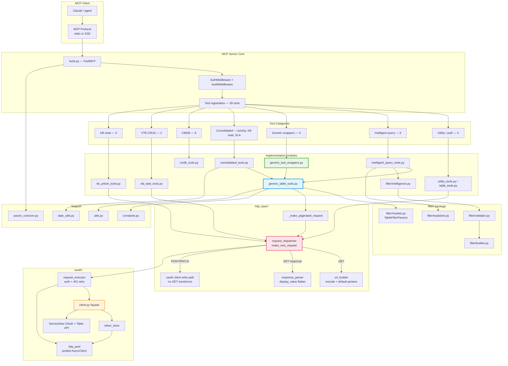

# MCP Server Architecture Overview (v4.3)

Layered view of the Personal MCP ServiceNow server after the v3 generic-tool consolidation, the v4 package splits (`filter/`, `http_layer/`, `oauth/`), v4.1 shim deletion, v4.1–4.2 KB/perf work, and v4.3 MCPB packaging.

```mermaid
graph TB
    subgraph "MCP Client"
        A[Claude / agent] --> B[MCP Protocol<br/>stdio or SSE]
    end

    subgraph "MCP Server Core"
        B --> C[tools.py — FastMCP]
        C --> MW[AuthMiddleware + AuditMiddleware]
        MW --> D[Tool registration — 39 tools]
    end

    subgraph "Tool Categories"
        D --> E[Utility / auth — 5]
        D --> F[Intelligent query — 6]
        D --> G[Generic wrappers — 5]
        D --> H[Consolidated — priority, KB read, SLA]
        D --> I[CMDB — 6]
        D --> J[VTB CRUD — 2]
        D --> K[KB write — 5]
    end

    subgraph "Implementation modules"
        E --> L[utility_tools.py / table_tools.py]
        F --> AI[intelligent_query_tools.py]
        G --> GW[generic_tool_wrappers.py]
        H --> CT[consolidated_tools.py]
        I --> CMDB[cmdb_tools.py]
        J --> VTB[vtb_task_tools.py]
        K --> KB[kb_article_tools.py]
        GW --> GTT[generic_table_tools.py]
        CT --> GTT
        AI --> GTT
        AI --> NLP[filter/intelligence.py]
    end

    subgraph "filter/ package"
        NLP --> FV[filter/validator.py]
        FV --> FB[filter/builder.py]
        AI --> FEXP[filter/explainer.py]
        GTT --> FMOD[filter/models.py<br/>TableFilterParams]
    end

    subgraph "http_layer/"
        GTT --> PAG[_make_paginated_request]
        PAG --> DISP[request_dispatcher<br/>make_nws_request]
        VTB --> DISP
        KB --> DISP
        L --> DISP
        DISP -->|GET| URL[url_builder<br/>encode + default params]
        DISP -->|GET response| RESP[response_parser<br/>display_value flatten]
        DISP -->|POST/PATCH| WRITE[oauth client write path<br/>no GET transforms]
    end

    subgraph "oauth/"
        DISP --> EXEC[request_executor<br/>auth + 401 retry]
        EXEC --> CLI[client.py façade]
        CLI --> TOK[token_store]
        EXEC --> POOL[http_pool<br/>pooled AsyncClient]
        TOK --> POOL
        CLI --> SN[ServiceNow OAuth + Table API]
    end

    subgraph "Support"
        GTT --> CONST[constants.py]
        GTT --> UTILS[utils.py]
        CT --> DATE[date_utils.py]
        C --> COERCE[param_coercion.py]
    end

    style GW fill:#e8f5e8,stroke:#4caf50,stroke-width:3px
    style GTT fill:#e1f5fe,stroke:#2196f3,stroke-width:3px
    style DISP fill:#fce4ec,stroke:#e91e63,stroke-width:2px
    style CLI fill:#fff3e0,stroke:#ff9800,stroke-width:2px
```

## Architecture components

### Core
- **Transport**: stdio (Claude Desktop / MCPB) or SSE (`MCP_TRANSPORT=sse`, Docker)
- **FastMCP** in `tools.py`: registers 39 tools; `AuthMiddleware` (SSE bearer) then `AuditMiddleware` (structured JSON logs to stderr)
- **`param_coercion`**: stringified JSON dict params coerced at the tool boundary (MCP clients sometimes send JSON as strings)

### Tool layer
| Module | Role |
|--------|------|
| `generic_tool_wrappers.py` | 5 table-parameterized tools; validates `table` against `TABLE_CONFIGS` |
| `consolidated_tools.py` | Priority incidents, knowledge read tools, 5 SLA tools |
| `vtb_task_tools.py` | `create_private_task` / `update_private_task` (PATCH) |
| `kb_article_tools.py` | Update, publish, batch publish, retire, duplicate check |
| `cmdb_tools.py` | 6 CMDB tools; concurrent CI table probes on detail lookup |
| `intelligent_query_tools.py` | NL search + filter explain/build/templates/examples + `get_query_syntax_help` |
| `utility_tools.py` / `table_tools.py` | Connectivity and auth diagnostics |

### `filter/` (v4.0 Sprint 1; shims removed v4.1)
- **builder**: `ServiceNowQueryBuilder` — OR / date-range / exclusion constructors
- **validator**: validate + `validate_and_correct_filters` (only bridge allowed to call builder from NL path)
- **intelligence**: `QueryIntelligence` — regex NL → filters; **does not** import builder
- **explainer**: human-readable explanation + size estimation
- **models**: `TableFilterParams`, `QueryValidationResult` (`SmartQueryParams` removed in v4.1)

### `http_layer/` (v4.0 Sprint 3)
- **`make_nws_request`**: GET applies `ensure_query_encoded` + `add_default_params` + `extract_display_values`
- **Writes (POST/PATCH/DELETE)**: bypass all three — locked by negative tests in `tests/test_http_layer.py`
- **Default GET params**: `sysparm_display_value=true`, `sysparm_exclude_reference_link=true`, `sysparm_no_count=true`
- **Pagination**: `_make_paginated_request` + deterministic `^ORDERBYDESCsys_created_on` unless an ORDERBY already exists

### `oauth/` (v4.0 Sprint 3 + v4.2 pool)
- **singleton** (`oauth/singleton.py`): process-wide client + `make_oauth_request`
- **client**: façade over TokenStore + RequestExecutor
- **token_store**: cache + refresh buffer before expiry
- **request_executor**: authenticated HTTP + single 401 → refresh → retry
- **http_pool** (v4.2): shared keep-alive `httpx.AsyncClient`
- **exceptions**: OAuth / Authentication / Connection / Authorization

### Configuration
- `constants.py`: `TABLE_CONFIGS`, `ESSENTIAL_FIELDS`, `DETAIL_FIELDS`, error strings
- Env vars or `~/.config/mcp-servicenow/config.json` via `config_loader.py`

## Supported tables

| Table | Prefix / notes |
|-------|----------------|
| `incident` | INC |
| `change_request` | CHG |
| `sc_req_item` | RITM |
| `sc_task` | SCTASK |
| `universal_request` | UR |
| `kb_knowledge` | KB; no priority field |
| `vtb_task` | VTB; only table with generic-path CRUD tools |
| `task_sla` | stage instead of state; no number prefix |

## Tool inventory (39 tools — v4.3)

| # | Tools | Source |
|---|--------|--------|
| 1–5 | `nowtest`, `now_test_oauth`, `now_auth_info`, `nowtestauth`, `nowtest_auth_input` | utility / table_tools |
| 6–10 | `search_records`, `get_record_summary`, `get_record`, `find_similar`, `filter_records` | generic_tool_wrappers |
| 11 | `get_priority_incidents` | consolidated_tools |
| 12–15 | `similar_knowledge_for_text`, `get_knowledge_by_category`, `get_active_knowledge_articles`, `get_kb_articles_by_state` | consolidated_tools |
| 16–17 | `create_private_task`, `update_private_task` | vtb_task_tools |
| 18–22 | `update_knowledge_article`, `publish_knowledge_article`, `publish_knowledge_articles`, `retire_knowledge_article`, `check_kb_duplicates` | kb_article_tools |
| 23–27 | `similar_slas_for_text`, `get_sla_details`, `query_slas_by_task`, `query_slas_by_status`, `query_slas_custom` | consolidated_tools |
| 28–33 | `find_cis_by_type`, `search_cis_by_attributes`, `get_ci_details`, `similar_cis_for_ci`, `get_all_ci_types`, `quick_ci_search` | cmdb_tools |
| 34–39 | `intelligent_search`, `explain_servicenow_filters`, `build_smart_servicenow_filter`, `get_servicenow_filter_templates`, `get_query_examples`, `get_query_syntax_help` | intelligent_query_tools |

## Version lineage (short)

| Release | What changed |
|---------|----------------|
| **v3** | 5 generic tools replace 24 wrappers; perf params + encoding + ORDERBY pagination |
| **v4.0** | SLA collapse (10→5); `filter/`, `http_layer/`, `oauth/` packages; shims temporary |
| **v4.1** | Shims deleted; KB write tools + `get_kb_articles_by_state`; `get_query_syntax_help`; `filter_records` truncation metadata |
| **v4.2** | Pooled httpx; single OR-combined LIKE text search; CMDB concurrency / encoding |
| **v4.3** | Claude Desktop `.mcpb` packaging (no Nuitka release path) |

## Key invariants

1. **GET** always applies encode + default sysparm + display-value flatten.
2. **Write methods** never apply those GET transforms.
3. **filter/intelligence** must not import **filter/builder** (auto-correct only via validator).
4. **Stdout** is reserved for MCP JSON-RPC; logs and prints go to **stderr**.
