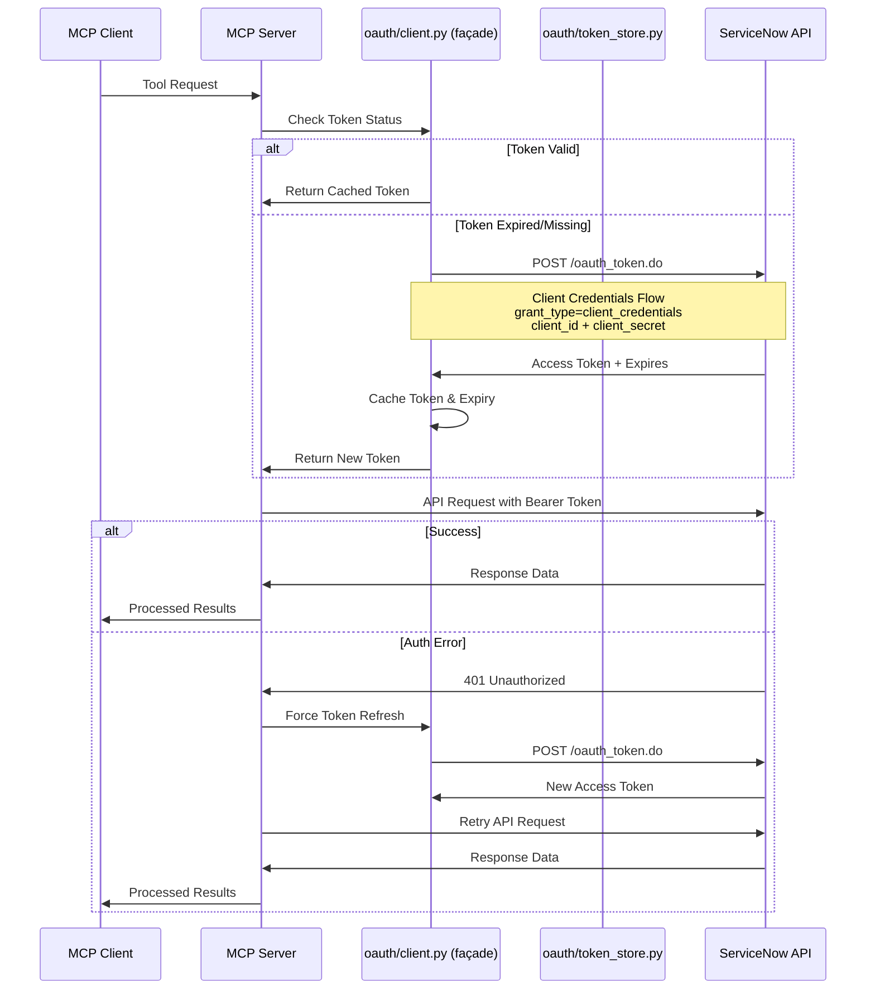

# OAuth 2.0 Authentication Flow

This sequence diagram illustrates how the MCP server handles OAuth 2.0 Client Credentials authentication with ServiceNow, including automatic token management and refresh.

> **v4.0 update**: the v3 `oauth_client.py` class was split into `oauth/token_store.py` + `oauth/request_executor.py` composed by a façade at `oauth/client.py`. The `oauth_client.py` shim retains the module-level singleton (`get_oauth_client`, `make_oauth_request`) for backwards compat. Sequence below collapses the subsystems under the façade for readability — see `01-architecture-overview.md` for the layered view.

## Authentication Features

- **Client Credentials Flow**: Secure machine-to-machine authentication
- **Automatic Token Management**: Tokens cached until near expiry
- **Thread-Safe Operations**: Async locks prevent concurrent token requests
- **Error Recovery**: Automatic retry on authentication failures
- **Environment Configuration**: Credentials loaded from `.env` file

## Security Benefits

- No hardcoded credentials in source code
- Tokens automatically expire and refresh
- Bearer token authentication (more secure than Basic Auth)
- Encrypted HTTPS communication with ServiceNow