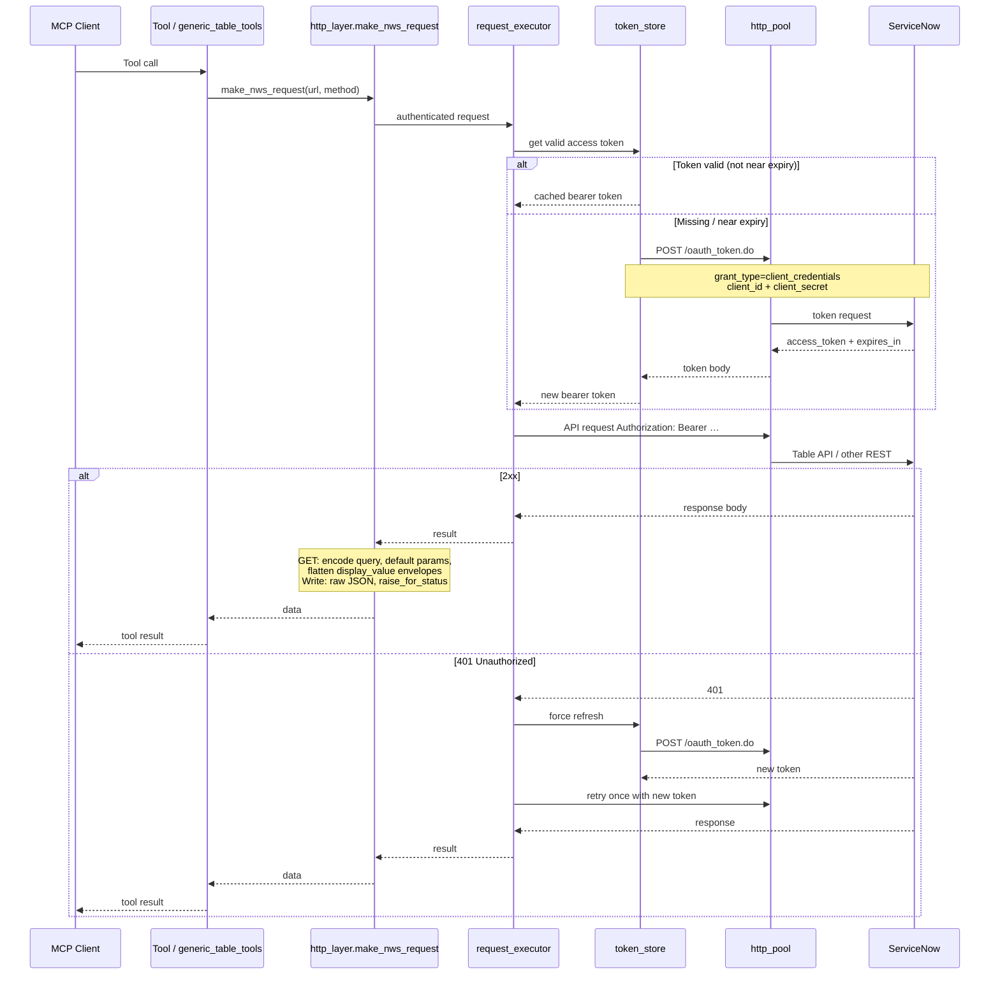

# OAuth 2.0 Authentication Flow (v4.3)

How the server obtains and uses ServiceNow OAuth 2.0 **client credentials** tokens, including cache, refresh buffer, and 401 retry.

## Package layout

| Module | Responsibility |
|--------|----------------|
| `oauth/singleton.py` | Process-wide client: `get_oauth_client()`, `make_oauth_request()` |
| `oauth/client.py` | `ServiceNowOAuthClient` façade |
| `oauth/token_store.py` | Access-token cache + refresh (injectable fetch function) |
| `oauth/request_executor.py` | Authenticated HTTP + 401 → refresh → one retry |
| `oauth/http_pool.py` | Shared keep-alive `httpx.AsyncClient` (v4.2) |
| `oauth/exceptions.py` | `ServiceNowOAuthError` + Authentication / Connection / Authorization |
| `http_layer/request_dispatcher.py` | Calls OAuth for GET and write paths via `make_nws_request` |

v3 `oauth_client.py` / `service_now_api_oauth.py` shims were **removed in v4.1**. Import from `oauth` and `http_layer` only.

```mermaid
sequenceDiagram
    participant Client as MCP Client
    participant Tool as Tool / generic_table_tools
    participant HTTP as http_layer.make_nws_request
    participant Exec as request_executor
    participant Store as token_store
    participant Pool as http_pool
    participant SN as ServiceNow

    Client->>Tool: Tool call
    Tool->>HTTP: make_nws_request(url, method)
    HTTP->>Exec: authenticated request

    Exec->>Store: get valid access token
    alt Token valid (not near expiry)
        Store-->>Exec: cached bearer token
    else Missing / near expiry
        Store->>Pool: POST /oauth_token.do
        Note over Store,SN: grant_type=client_credentials<br/>client_id + client_secret
        Pool->>SN: token request
        SN-->>Pool: access_token + expires_in
        Pool-->>Store: token body
        Store-->>Exec: new bearer token
    end

    Exec->>Pool: API request Authorization: Bearer …
    Pool->>SN: Table API / other REST
    alt 2xx
        SN-->>Exec: response body
        Exec-->>HTTP: result
        Note over HTTP: GET: encode query, default params,<br/>flatten display_value envelopes<br/>Write: raw JSON, raise_for_status
        HTTP-->>Tool: data
        Tool-->>Client: tool result
    else 401 Unauthorized
        SN-->>Exec: 401
        Exec->>Store: force refresh
        Store->>Pool: POST /oauth_token.do
        SN-->>Store: new token
        Exec->>Pool: retry once with new token
        SN-->>Exec: response
        Exec-->>HTTP: result
        HTTP-->>Tool: data
        Tool-->>Client: tool result
    end
```

## Behaviour details

### Client credentials
- Config from environment (`SERVICENOW_INSTANCE`, `SERVICENOW_CLIENT_ID`, `SERVICENOW_CLIENT_SECRET`) or config file (env wins).
- Basic auth is **not** supported.
- Token endpoint: `{instance}/oauth_token.do`.

### Token lifecycle
- Tokens are cached in memory on the process-wide client.
- Refresh is requested **before** hard expiry (`TOKEN_REFRESH_BUFFER_MINUTES`) to avoid edge-of-life 401s.
- Concurrent refresh is serialized so only one token request races.

### HTTP client pool (v4.2)
- One shared `httpx.AsyncClient` for token fetch, data requests, and 401 retry.
- Reduces TLS/handshake cost vs a new client per call.
- Tests reset the pool in `conftest.py`; production closes via `shutdown_http_client()` / atexit.

### Read vs write through the same OAuth path
Both use authenticated HTTP, but **`make_nws_request`** branches:

| Method | URL encoding + default sysparm | Display-value flatten | Errors |
|--------|--------------------------------|------------------------|--------|
| GET | Yes | Yes | Soft fail / empty depending on caller |
| POST / PATCH / DELETE | No | No | `raise_for_status` so VTB/KB map 4xx/5xx |

### SSE auth (separate from ServiceNow OAuth)
When `MCP_TRANSPORT=sse`, `AuthMiddleware` can require a shared-secret bearer on the **MCP** channel. That is independent of ServiceNow client credentials. ServiceNow auth is always OAuth as above.

## Security notes

- Secrets live in env / config / Key Vault — never in the repo or `.mcpb` staging whitelist.
- Logs (audit middleware) redact parameter names matching password/secret/token/key/auth/credential.
- All ServiceNow traffic is HTTPS.
