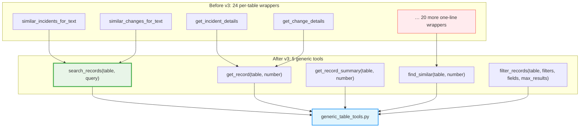
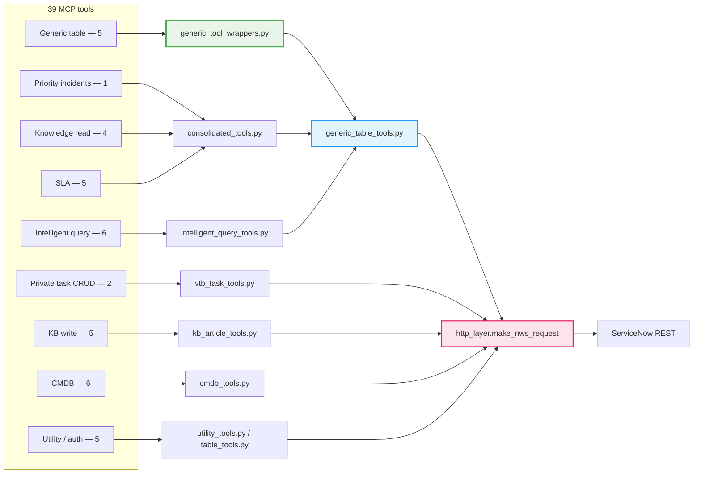
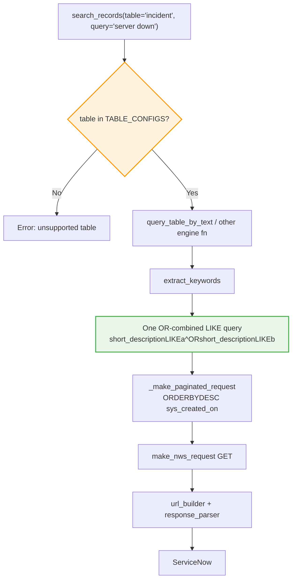

# Tool Organization (v4.3)

How 39 MCP tools are grouped by module, and how the v3 generic-wrapper consolidation still underpins table access.

## Historical consolidation (v3 — still the foundation)

```mermaid
graph TB
    subgraph "Before v3: 24 per-table wrappers"
        OLD1[similar_incidents_for_text]
        OLD2[similar_changes_for_text]
        OLD3[get_incident_details]
        OLD4[get_change_details]
        OLD5["… 20 more one-line wrappers"]
    end

    subgraph "After v3: 5 generic tools"
        NEW1["search_records(table, query)"]
        NEW2["get_record(table, number)"]
        NEW3["get_record_summary(table, number)"]
        NEW4["find_similar(table, number)"]
        NEW5["filter_records(table, filters, fields, max_results)"]
    end

    OLD1 --> NEW1
    OLD2 --> NEW1
    OLD3 --> NEW2
    OLD4 --> NEW2
    OLD5 --> NEW4

    NEW1 --> GTT[generic_table_tools.py]
    NEW2 --> GTT
    NEW3 --> GTT
    NEW4 --> GTT
    NEW5 --> GTT

    style NEW1 fill:#e8f5e8,stroke:#4caf50,stroke-width:3px
    style GTT fill:#e1f5fe,stroke:#2196f3,stroke-width:2px
    style OLD5 fill:#ffebee,stroke:#f44336,stroke-width:1px
```

Later releases **added** domain tools (KB write, SLA collapse, syntax help) without bringing back per-table search wrappers.

## Current tool map (39 tools)

```mermaid
graph LR
    subgraph "39 MCP tools"
        A[Generic table — 5]
        B[Priority incidents — 1]
        C[Knowledge read — 4]
        D[KB write — 5]
        E[Private task CRUD — 2]
        F[SLA — 5]
        G[CMDB — 6]
        H[Intelligent query — 6]
        I[Utility / auth — 5]
    end

    A --> W[generic_tool_wrappers.py]
    B --> CNS[consolidated_tools.py]
    C --> CNS
    F --> CNS
    D --> KB[kb_article_tools.py]
    E --> VTB[vtb_task_tools.py]
    G --> CMDB[cmdb_tools.py]
    H --> IQ[intelligent_query_tools.py]
    I --> U[utility_tools.py / table_tools.py]

    W --> GTT[generic_table_tools.py]
    CNS --> GTT
    IQ --> GTT
    GTT --> HTTP[http_layer.make_nws_request]
    VTB --> HTTP
    KB --> HTTP
    CMDB --> HTTP
    U --> HTTP
    HTTP --> SN[ServiceNow REST]

    style W fill:#e8f5e8,stroke:#4caf50,stroke-width:3px
    style GTT fill:#e1f5fe,stroke:#2196f3,stroke-width:2px
    style HTTP fill:#fce4ec,stroke:#e91e63,stroke-width:2px
```

## Generic wrapper path

```mermaid
graph TB
    CALL["search_records(table='incident', query='server down')"]
    CALL --> VAL{table in TABLE_CONFIGS?}
    VAL -->|No| ERR[Error: unsupported table]
    VAL -->|Yes| DELEGATE[query_table_by_text / other engine fn]

    DELEGATE --> KW[extract_keywords]
    KW --> ORQ["One OR-combined LIKE query<br/>short_descriptionLIKEa^ORshort_descriptionLIKEb"]
    ORQ --> PAG[_make_paginated_request<br/>ORDERBYDESC sys_created_on]
    PAG --> REQ[make_nws_request GET]
    REQ --> URL[url_builder + response_parser]
    URL --> SN[ServiceNow]

    style VAL fill:#fff3e0,stroke:#ff9800,stroke-width:2px
    style ORQ fill:#e8f5e8,stroke:#4caf50,stroke-width:2px
```

### Supported tables (`TABLE_CONFIGS`)

`incident` · `change_request` · `sc_req_item` · `sc_task` · `universal_request` · `kb_knowledge` · `vtb_task` · `task_sla`

## Categories in detail

### Generic table tools (5) — `generic_tool_wrappers.py`

| Tool | Engine function | Notes |
|------|-----------------|--------|
| `search_records` | `query_table_by_text` | Single OR-LIKE request (v4.2) |
| `get_record` | `get_record_details` | Detail field set |
| `get_record_summary` | short description path | Lean response |
| `find_similar` | `find_similar_records` | Similarity via description text |
| `filter_records` | `query_table_with_filters` | Optional `max_results` (default 100, max 1000); response includes `returned_count`, `truncated`, `max_results` |

### Consolidated tools — `consolidated_tools.py`

- **Priority**: `get_priority_incidents` — date ranges + metadata (MCP wrapper strips `**kwargs` for FastMCP v3)
- **Knowledge read** (4): `similar_knowledge_for_text`, `get_knowledge_by_category`, `get_active_knowledge_articles`, `get_kb_articles_by_state` (collapses KB versions to one row per `number`)
- **SLA** (5): see [06-sla-architecture-flow.md](./06-sla-architecture-flow.md)

### KB write (5) — `kb_article_tools.py`

`update_knowledge_article` · `publish_knowledge_article` · `publish_knowledge_articles` (batch, cap 20) · `retire_knowledge_article` · `check_kb_duplicates`

Shared helpers in `write_helpers.py` (`map_http_error`, `unwrap_write_response`).

### Private tasks (2) — `vtb_task_tools.py`

`create_private_task` · `update_private_task` (HTTP **PATCH** for partial updates)

### CMDB (6) — `cmdb_tools.py`

`find_cis_by_type` · `search_cis_by_attributes` · `get_ci_details` · `similar_cis_for_ci` · `get_all_ci_types` · `quick_ci_search`

### Intelligent query (6) — `intelligent_query_tools.py`

`intelligent_search` · `explain_servicenow_filters` · `build_smart_servicenow_filter` · `get_servicenow_filter_templates` · `get_query_examples` · `get_query_syntax_help` (encoded-query operator reference)

### Utility / auth (5)

`nowtest` · `now_test_oauth` · `now_auth_info` · `nowtestauth` · `nowtest_auth_input`

## Counts over time

| Era | Approx. tool count | Notes |
|-----|-------------------|--------|
| Pre-v3 | ~55 | Many per-table wrappers |
| v3 | ~36–37 | Generic wrappers land |
| v4.0 | 32 | SLA 10 → 5 |
| v4.1+ | **39** | KB expansion + `get_query_syntax_help` + state collapse tool |

## Extensibility

1. Add an entry to `TABLE_CONFIGS` / field maps in `constants.py`
2. The five generic tools pick up the table automatically
3. Add a dedicated tool only when behaviour cannot fit the generic engine (dates, KB workflow, CMDB multi-table, SLA presets)
