# Tool Organization & Generic Layer

This diagram shows how the 35+ MCP tools are organized by ServiceNow table type and how they leverage a generic layer to minimize code duplication.

## Tool Categories Overview

```mermaid
graph LR
    subgraph "35+ MCP Tools by Category"
        A[🎫 Incident Tools<br/>5 tools]
        B[🔄 Change Tools<br/>4 tools]  
        C[📚 Knowledge Tools<br/>4 tools]
        D[🖥️ CMDB Tools<br/>6 tools]
        E[📋 User Request Tools<br/>4 tools]
        F[📝 Private Task Tools<br/>4 tools]
        G[🔧 Utility Tools<br/>3 tools]
    end
    
    A --> H[All tools use same<br/>generic functions]
    B --> H
    C --> H
    D --> H
    E --> H
    F --> H
    G --> I[Direct API access<br/>for testing]
    
    H --> J[🏗️ Generic Layer<br/>5 reusable functions]
    I --> K[🔗 ServiceNow API]
    J --> K
```

## Generic Function Architecture

```mermaid
graph TB
    subgraph "Tool Pattern Examples"
        A1[similarincidentsfortext] --> G1[query_table_by_text]
        A2[similarchangesfortext] --> G1
        A3[similar_knowledge_for_text] --> G1
        A4[similarURfortext] --> G1
        
        B1[getincidentdetails] --> G2[get_record_details] 
        B2[getchangedetails] --> G2
        B3[get_knowledge_details] --> G2
        B4[getURdetails] --> G2
    end
    
    subgraph "5 Generic Functions"
        G1[📝 query_table_by_text<br/>Text similarity search]
        G2[📋 get_record_details<br/>Full record information]
        G3[🔍 get_record_description<br/>Short description only]
        G4[🔗 find_similar_records<br/>Find related records]
        G5[🎯 query_table_with_filters<br/>Advanced filtering]
    end
    
    subgraph "ServiceNow Integration"
        G1 --> API[make_nws_request]
        G2 --> API
        G3 --> API  
        G4 --> API
        G5 --> API
        
        API --> AUTH[OAuth 2.0 Authentication]
        API --> FIELDS[Optimized Field Selection]
        API --> NLP[spaCy Keyword Extraction]
    end
    
    style G1 fill:#e1f5fe
    style G2 fill:#e8f5e8
    style G3 fill:#fff3e0
    style G4 fill:#fce4ec
    style G5 fill:#f3e5f5
```

## Tool Categories

- **Incident Tools**: 5 tools for incident management
- **Change Tools**: 4 tools for change request handling  
- **Knowledge Tools**: 4 tools for knowledge base articles
- **CMDB Tools**: 6 tools for configuration item management
- **User Request Tools**: 4 tools for service catalog requests
- **Private Task Tools**: 4 tools for custom task management
- **Utility Tools**: 3 tools for server testing and authentication

## Generic Layer Benefits

- **Code Reuse**: 5 generic functions serve 25+ specific tools
- **Consistency**: Same behavior patterns across all table types
- **Maintainability**: Single point of change for common operations
- **Performance**: Optimized field selection and query patterns
- **Extensibility**: Easy to add new table types

## Optimization Features

- **Essential vs Detail Fields**: Minimal data transfer for list operations
- **Keyword Extraction**: NLP-powered search term identification
- **Early Exit Strategy**: Return first successful match
- **Token Caching**: Reuse OAuth tokens across requests