# 🚀 Tool Organization & Revolutionary Consolidation

This diagram shows the **MAJOR ARCHITECTURAL TRANSFORMATION** from 35+ scattered tools to a unified, AI-powered architecture with consolidated interfaces and intelligent processing.

## 🔥 Before vs After: Revolutionary Change

```mermaid
graph TB
    subgraph "❌ BEFORE: Scattered Architecture"
        OLD1[incident_tools.py - 6 functions]
        OLD2[change_tools.py - 4 functions]
        OLD3[kb_tools.py - 4 functions]
        OLD4[ur_tools.py - 4 functions]
        OLD5[Duplicate code everywhere]
        OLD6[SpaCy NLP dependency]
    end

    subgraph "✅ AFTER: Consolidated AI Architecture"
        NEW1[📦 consolidated_tools.py - UNIFIED INTERFACE]
        NEW2[⚡ generic_table_tools.py - ENHANCED]
        NEW3[🧠 query_intelligence.py - AI ENGINE]
        NEW4[🎯 intelligent_query_tools.py - AI TOOLS]
        NEW5[📊 Compiled regex patterns]
        NEW6[🛡️ ReDoS protection]
    end

    OLD1 --> NEW1
    OLD2 --> NEW1
    OLD3 --> NEW1
    OLD4 --> NEW1
    OLD5 --> NEW2
    OLD6 --> NEW5

    NEW1 --> NEW2
    NEW2 --> NEW3
    NEW3 --> NEW4

    style NEW1 fill:#e8f5e8,stroke:#4caf50,stroke-width:3px
    style NEW3 fill:#f3e5f5,stroke:#9c27b0,stroke-width:3px
    style OLD5 fill:#ffebee,stroke:#f44336,stroke-width:2px
```

## 🧠 AI-Enhanced Tool Categories Overview

```mermaid
graph LR
    subgraph "🚀 30+ MCP Tools - Revolutionized Architecture"
        A[🎫 Incident Tools<br/>6 tools - AI enhanced]
        B[🔄 Change Tools<br/>4 tools - Consolidated]
        C[📚 Knowledge Tools<br/>4 tools - Consolidated]
        D[🖥️ CMDB Tools<br/>6 tools - Independent]
        E[📋 User Request Tools<br/>4 tools - Consolidated]
        F[📝 Private Task Tools<br/>5 tools - CRUD enabled]
        G[🔧 Utility Tools<br/>5 tools - Enhanced]
        H[🧠 AI Intelligence Tools<br/>5 NEW tools]
    end

    A --> I[📦 Consolidated Interface]
    B --> I
    C --> I
    E --> I
    F --> I
    D --> J[🖥️ Specialized CMDB Layer]
    G --> K[🔐 Direct OAuth API]
    H --> L[🧠 AI Processing Engine]

    I --> M[⚡ Enhanced Generic Layer]
    J --> K
    L --> M
    M --> K
    K --> N[🔗 ServiceNow API]

    style I fill:#e8f5e8,stroke:#4caf50,stroke-width:3px
    style L fill:#f3e5f5,stroke:#9c27b0,stroke-width:3px
    style H fill:#fff3e0,stroke:#ff9800,stroke-width:3px
```

## 🚀 Revolutionary Generic Function Architecture

```mermaid
graph TB
    subgraph "📦 Consolidated Tool Pattern Examples"
        A1[similar_incidents_for_text] --> G1[query_table_by_text]
        A2[similar_changes_for_text] --> G1
        A3[similar_knowledge_for_text] --> G1
        A4[similar_ur_for_text] --> G1

        B1[get_incident_details] --> G2[get_record_details]
        B2[get_change_details] --> G2
        B3[get_knowledge_details] --> G2
        B4[get_ur_details] --> G2

        C1[intelligent_search] --> AI1[query_table_intelligently]
        C2[build_smart_servicenow_filter] --> AI2[build_and_validate_smart_filter]
        C3[explain_servicenow_filters] --> AI3[explain_filter_query]
    end

    subgraph "⚡ Enhanced Generic Functions"
        G1[📝 query_table_by_text<br/>Enhanced text search with pagination]
        G2[📋 get_record_details<br/>Full record information]
        G3[🔍 get_record_description<br/>Short description only]
        G4[🔗 find_similar_records<br/>Intelligent similarity matching]
        G5[🎯 query_table_with_filters<br/>Natural language parsing]
        G6[⚡ get_records_by_priority<br/>Generic priority queries]
        G7[📊 query_table_with_generic_filters<br/>Advanced filtering]
    end

    subgraph "🧠 NEW: AI-Powered Functions"
        AI1[🧠 query_table_intelligently<br/>Natural language queries]
        AI2[🎯 build_and_validate_smart_filter<br/>AI filter generation]
        AI3[💡 explain_filter_query<br/>Filter intelligence]
        AI4[📋 Smart Templates<br/>Enterprise patterns]
        AI5[🛡️ ReDoS Protection<br/>Security validation]
    end

    subgraph "🔗 Enhanced ServiceNow Integration"
        G1 --> API[_make_paginated_request]
        G2 --> API
        G3 --> API
        G4 --> API
        G5 --> API
        G6 --> API
        G7 --> API

        AI1 --> API
        AI2 --> VALID[query_validation.py]
        AI3 --> VALID

        API --> AUTH[OAuth 2.0 Only]
        API --> FIELDS[Optimized Field Selection from constants.py]
        API --> NLP[⚡ Compiled Regex Patterns]

        VALID --> PROTECT[🛡️ Input Validation]
        NLP --> PROTECT
        AI5 --> PROTECT
    end

    subgraph "🗃️ Configuration & Constants"
        CONST[📋 constants.py<br/>Table configs, field definitions]
        VALID --> CONST
        API --> CONST
        G5 --> CONST
    end

    style G1 fill:#e1f5fe,stroke:#2196f3,stroke-width:2px
    style G5 fill:#f3e5f5,stroke:#9c27b0,stroke-width:2px
    style AI1 fill:#fff3e0,stroke:#ff9800,stroke-width:3px
    style AI2 fill:#f3e5f5,stroke:#9c27b0,stroke-width:3px
    style PROTECT fill:#ffebee,stroke:#f44336,stroke-width:2px
```

## 🚀 Revolutionary Tool Categories (Post-Consolidation)

### **🧠 AI-Powered Intelligent Query Tools (5 NEW tools)**
- **intelligent_search()**: Natural language query processing with confidence scoring
- **build_smart_servicenow_filter()**: AI-powered filter generation and validation
- **explain_servicenow_filters()**: Filter intelligence with SQL generation
- **get_servicenow_filter_templates()**: Enterprise-grade pre-built patterns
- **get_query_examples()**: Natural language query examples and tips

### **📦 Consolidated Table Tools (20+ tools - Zero Regression)**
- **Incident Tools**: 6 tools (including AI-enhanced priority queries)
- **Change Tools**: 4 tools (unified through consolidated interface)
- **Knowledge Tools**: 4 tools (category filtering and search)
- **User Request Tools**: 4 tools (service catalog request handling)
- **Private Task Tools**: 5 tools (full CRUD operations enabled)

### **🖥️ CMDB Tools (6 specialized tools)**
- Configuration item discovery and search
- Multi-attribute CI queries and analysis
- Relationship mapping and similar CI finding

### **🔧 Utility Tools (5 enhanced tools)**
- Server connectivity and OAuth authentication testing
- ServiceNow API validation and debugging

## 🔥 Revolutionary Consolidation Benefits

### **🏗️ Architectural Advantages**
- **Code Reduction**: 562 lines removed, 420 lines added (net -142 lines)
- **File Elimination**: 4 table-specific files deleted with zero functional loss
- **Unified Interface**: All table operations through single consolidated interface
- **Generic Foundation**: 7 enhanced generic functions serve 20+ specific tools
- **AI Enhancement**: Natural language processing adds powerful new capabilities

### **⚡ Performance Improvements**
- **Compiled Regex**: Performance-focused keyword extraction vs SpaCy NLP
- **Pagination Support**: Comprehensive result retrieval preventing data loss
- **Field Optimization**: Essential vs detail fields for minimal data transfer
- **Token Caching**: OAuth 2.0 tokens reused across requests (1-hour expiry)
- **Early Exit Strategy**: Return first successful match for text searches

### **🛡️ Security & Quality Features**
- **ReDoS Protection**: Windows-compatible protection against malicious regex
- **Input Validation**: Pre-validation of all text inputs to prevent attacks
- **OAuth 2.0 Only**: Enhanced security with exclusive OAuth authentication
- **SonarCloud Compliance**: All cognitive complexity violations resolved (≤15)
- **Code Quality**: Single responsibility principle and modular design

### **🧠 AI Intelligence Features**
- **Natural Language Processing**: Advanced query understanding with confidence scoring
- **Smart Templates**: Pre-built enterprise filter patterns for common scenarios
- **Filter Intelligence**: Automatic explanation and SQL equivalent generation
- **Query Validation**: Built-in ServiceNow syntax validation and correction
- **Context Awareness**: Intelligent parsing of dates, priorities, and exclusions

## 📊 Measurable Improvements

### **Before Consolidation**
- 35+ tools across 7+ files
- Code duplication everywhere
- SpaCy NLP dependency (47MB)
- Manual keyword extraction
- No AI capabilities
- Basic error handling

### **After Revolutionary Changes**
- 30+ tools through unified architecture
- 4 files eliminated, zero regression
- Compiled regex patterns (lightweight)
- AI-powered natural language processing
- Enterprise-grade security features
- Comprehensive input validation

## 🎯 Extensibility & Future-Proofing

### **Easy Table Addition**
1. Add table configuration to `constants.py`
2. Functions automatically work through generic layer
3. AI features immediately available
4. No code duplication required

### **AI Enhancement Ready**
- Natural language processing framework established
- Filter intelligence engine operational
- Template system for rapid deployment
- Query validation and correction built-in

### **Security-First Architecture**
- ReDoS protection at input layer
- OAuth 2.0 exclusive authentication
- Input validation for all user data
- Attack resistance testing included