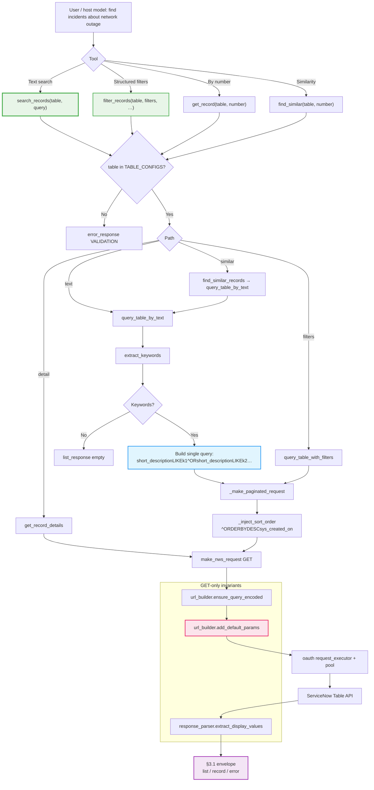

# Search & Query Flow (v5.0)

How text search and structured filters reach ServiceNow: keyword extraction, **one** OR-combined LIKE query (v4.2), pagination, the GET-only HTTP transforms, and the §3.1 response envelopes.

> **v5.0 note:** the in-repo NL path (`intelligent_search`, `filter/intelligence`, `filter/explainer`) is gone. The host model builds filters natively and calls `search_records` / `filter_records` directly.

## End-to-end flow


```mermaid
flowchart TD
    A["User / host model: find incidents about network outage"] --> B{Tool}
    B -->|Text search| C["search_records(table, query)"]
    B -->|Structured filters| FR["filter_records(table, filters, …)"]
    B -->|By number| GR["get_record(table, number)"]
    B -->|Similarity| FS["find_similar(table, number)"]

    C --> VAL{table in TABLE_CONFIGS?}
    FR --> VAL
    GR --> VAL
    FS --> VAL
    VAL -->|No| VALERR["error_response VALIDATION"]
    VAL -->|Yes| ROUTE{Path}

    ROUTE -->|text| E[query_table_by_text]
    ROUTE -->|filters| R[query_table_with_filters]
    ROUTE -->|detail| DET[get_record_details]
    ROUTE -->|similar| SIM[find_similar_records → query_table_by_text]

    E --> G[extract_keywords]
    G --> H{Keywords?}
    H -->|No| L["list_response empty"]
    H -->|Yes| ORQ["Build single query:<br/>short_descriptionLIKEk1^ORshort_descriptionLIKEk2…"]

    ORQ --> PAG
    R --> PAG
    DET --> API
    SIM --> E

    PAG[_make_paginated_request]
    PAG --> SORT[_inject_sort_order<br/>^ORDERBYDESCsys_created_on]
    SORT --> API[make_nws_request GET]
    API --> ENC[url_builder.ensure_query_encoded]
    ENC --> PERF[url_builder.add_default_params]
    PERF --> OAUTH[oauth request_executor + pool]
    OAUTH --> SN[ServiceNow Table API]
    SN --> FLAT[response_parser.extract_display_values]
    FLAT --> OUT["§3.1 envelope<br/>list / record / error"]

    subgraph "GET-only invariants"
        ENC
        PERF
        FLAT
    end

    style C fill:#e8f5e8,stroke:#4caf50,stroke-width:3px
    style FR fill:#e8f5e8,stroke:#4caf50,stroke-width:2px
    style ORQ fill:#e1f5fe,stroke:#2196f3,stroke-width:2px
    style PERF fill:#fce4ec,stroke:#e91e63,stroke-width:2px
    style OUT fill:#f3e5f5,stroke:#9c27b0,stroke-width:2px
```

## Generic search (`search_records`)

1. **Validate table** against `TABLE_CONFIGS` (8 tables, derived from `table_spec.TABLE_SPECS`).
2. **Extract keywords** via compiled regex / stop-word filtering (`utils.extract_keywords`).
3. **Build one `sysparm_query`**:  
   `short_descriptionLIKE{k1}^ORshort_descriptionLIKE{k2}^OR…`  
   (v4.2 — **not** one serial request per keyword; LIKE, never CONTAINS).
4. **Paginate** with `sysparm_offset` / `sysparm_limit` and deterministic sort.
5. **GET pipeline** in `make_nws_request`:
   - encode `sysparm_query` (preserve SN operators in the transport safe-set)
   - inject `sysparm_display_value`, `sysparm_exclude_reference_link`, `sysparm_no_count`
   - flatten `{display_value, value}` envelopes
6. **Return** `list_response` → `{result, returned_count, truncated}`. Failures raise then map to `{error: {code, message}}`.

### Example URL shape

```
/api/now/table/incident
  ?sysparm_fields=number,short_description,…
  &sysparm_query=short_descriptionLIKEnetwork^ORshort_descriptionLIKEoutage^ORDERBYDESCsys_created_on
  &sysparm_display_value=true
  &sysparm_exclude_reference_link=true
  &sysparm_no_count=true
  &sysparm_limit=…
  &sysparm_offset=0
```

## Similarity (`find_similar`)

1. Load the seed record’s short description (or detail fields).
2. Reuse **`query_table_by_text`** on that description so the same OR-LIKE path runs.
3. Return peer records as a list envelope (excluding trivial self-matches as implemented in the engine).

## Structured filter (`filter_records`)

- Accepts structured filter maps (and coerced JSON dicts via `param_coercion`).
- Optional **`max_results`** (default 100, max 1000).
- Response: **`{result, returned_count, truncated}`** (§3.1 list shape; `max_results` is a call param, not a response key requirement beyond truncation detection).
- Filter values pass through `filter/value_encoding.encode_query_value` (refuses `^` in operands); assembled queries go through the transport encoder.

## Single record (`get_record`)

- Returns **`{record: {...}}`** on hit, **`{record: null}`** on miss — never a one-row `result` list.
- Detail field set from `DETAIL_FIELDS` (derived from `TableSpec`).

## Host-model NL (replaces removed intelligent_search)

The host model translates natural language into:

- `search_records(table, "keywords…")` for free-text, or
- `filter_records(table, {field: value, …})` for structured conditions, or
- `get_query_syntax_help` when it needs the encoded-query operator reference.

There is no server-side regex NL engine and no confidence/explanation metadata path.

## HTTP enhancements (still critical)

| Concern | Implementation |
|---------|----------------|
| Stable pages | `_inject_sort_order` → `^ORDERBYDESCsys_created_on` unless ORDERBY present |
| Value encoding | `encode_query_value` — safe `=<>():@!`; **refuses `^`** in operand values |
| Transport encoding | `encode_query_string` — safe `=<>^():@!` (**no `&`** — v4.4.1) |
| Token size / latency | `exclude_reference_link` + `no_count` + essential field lists |
| Display values | flatten after GET only |
| Read failure | raises `ServiceNowRequestError` — never `None` for failure |

Writes (VTB, KB) use the same OAuth stack but **skip** encode/default-params/flatten.
