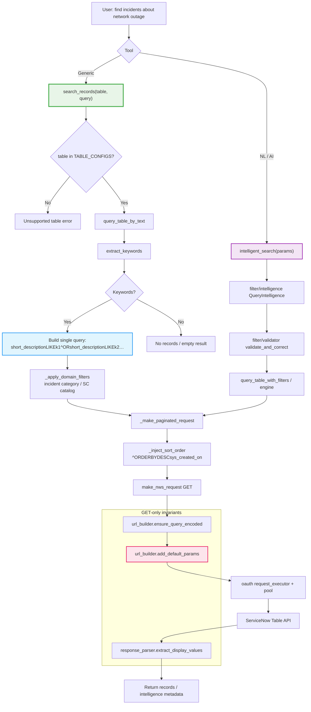

# Search & Query Flow (v4.3)

How text search and AI-assisted search reach ServiceNow: keyword extraction, **one** OR-combined LIKE query (v4.2), domain filters, pagination, and the GET-only HTTP transforms.

## End-to-end flow


```mermaid
flowchart TD
    A["User: find incidents about network outage"] --> B{Tool}
    B -->|Generic| C["search_records(table, query)"]
    B -->|NL / AI| D["intelligent_search(params)"]

    C --> VAL{table in TABLE_CONFIGS?}
    VAL -->|No| VALERR[Unsupported table error]
    VAL -->|Yes| E[query_table_by_text]

    D --> F[filter/intelligence QueryIntelligence]
    F --> V[filter/validator validate_and_correct]
    V --> R[query_table_with_filters / engine]

    E --> G[extract_keywords]
    G --> H{Keywords?}
    H -->|No| L[No records / empty result]
    H -->|Yes| ORQ["Build single query:<br/>short_descriptionLIKEk1^ORshort_descriptionLIKEk2…"]

    ORQ --> CAT[_apply_domain_filters<br/>incident category / SC catalog]
    CAT --> PAG
    R --> PAG

    PAG[_make_paginated_request]
    PAG --> SORT[_inject_sort_order<br/>^ORDERBYDESCsys_created_on]
    SORT --> API[make_nws_request GET]
    API --> ENC[url_builder.ensure_query_encoded]
    ENC --> PERF[url_builder.add_default_params]
    PERF --> OAUTH[oauth request_executor + pool]
    OAUTH --> SN[ServiceNow Table API]
    SN --> FLAT[response_parser.extract_display_values]
    FLAT --> OUT[Return records / intelligence metadata]

    subgraph "GET-only invariants"
        ENC
        PERF
        FLAT
    end

    style C fill:#e8f5e8,stroke:#4caf50,stroke-width:3px
    style D fill:#f3e5f5,stroke:#9c27b0,stroke-width:2px
    style ORQ fill:#e1f5fe,stroke:#2196f3,stroke-width:2px
    style PERF fill:#fce4ec,stroke:#e91e63,stroke-width:2px
```

## Generic search (`search_records`)

1. **Validate table** against `TABLE_CONFIGS` (8 tables).
2. **Extract keywords** via compiled regex / stop-word filtering (`utils.extract_keywords`).
3. **Build one `sysparm_query`**:  
   `short_descriptionLIKE{k1}^ORshort_descriptionLIKE{k2}^OR…`  
   (v4.2 — **not** one serial request per keyword).
4. **Domain filters** when enabled: incident category exclusion, SC catalog exclusion.
5. **Paginate** with `sysparm_offset` / `sysparm_limit` and deterministic sort.
6. **GET pipeline** in `make_nws_request`:
   - encode `sysparm_query` (preserve SN operators in the safe set)
   - inject `sysparm_display_value`, `sysparm_exclude_reference_link`, `sysparm_no_count`
   - flatten `{display_value, value}` envelopes

### Example URL shape

```
/api/now/table/incident
  ?sysparm_fields=number,short_description,…
  &sysparm_query=short_descriptionLIKEnetwork^ORshort_descriptionLIKEoutage^ORDERBYDESCsys_created_on
  &sysparm_display_value=true
  &sysparm_exclude_reference_link=true
  &sysparm_no_count=true
  &sysparm_limit=…
  &sysparm_offset=0
```

## AI-assisted search (`intelligent_search`)

1. Parse natural language with **`filter.intelligence.QueryIntelligence`** (regex-based, not an external LLM).
2. Map phrases to priority / date / state / keyword fragments.
3. **Validate / auto-correct** in `filter.validator` (may call `ServiceNowQueryBuilder` — intelligence never imports builder).
4. Execute via the table filter engine; attach confidence, explanation, and related metadata when available.
5. Fall back to text search (`query_table_by_text`) when NL conversion is weak.

Related tools (same package):  
`build_smart_servicenow_filter`, `explain_servicenow_filters`, `get_servicenow_filter_templates`, `get_query_examples`, `get_query_syntax_help`.

## Similarity (`find_similar`)

1. Load the seed record’s short description (or detail fields).
2. Reuse **`query_table_by_text`** on that description so the same OR-LIKE + domain-filter path runs.
3. Return peer records (excluding trivial self-matches as implemented in the engine).

## Structured filter (`filter_records`)

- Accepts structured filter maps (and coerced JSON dicts via `param_coercion`).
- Optional **`max_results`** (default 100, max 1000).
- Response metadata: **`returned_count`**, **`truncated`**, **`max_results`** for partial-set detection (v4.1).

## HTTP enhancements (still critical)

| Concern | Implementation |
|---------|----------------|
| Stable pages | `_inject_sort_order` → `^ORDERBYDESCsys_created_on` unless ORDERBY present |
| Encoding | `ensure_query_encoded` — unquote then `quote(..., safe='=<>&^():@!')` |
| Token size / latency | `exclude_reference_link` + `no_count` + essential field lists |
| Display values | flatten after GET only |

Writes (VTB, KB) use the same OAuth stack but **skip** encode/default-params/flatten.
