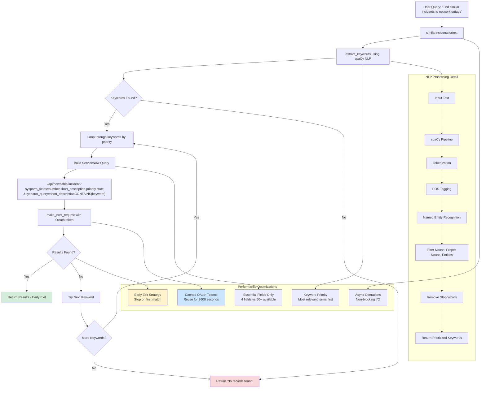

# Similarity Search Data Flow

This flowchart demonstrates how the MCP server processes text-based similarity searches, using NLP and optimization techniques for efficient ServiceNow queries.

## Search Flow Steps

1. **Input Processing**: User provides natural language query
2. **NLP Analysis**: spaCy extracts meaningful keywords from text
3. **Query Construction**: Build optimized ServiceNow API queries
4. **Iterative Search**: Try keywords in priority order
5. **Early Exit**: Return immediately on first successful match
6. **Fallback**: Continue with remaining keywords if needed

## Optimization Strategies

### Performance Optimizations
- **Minimal Field Selection**: Only essential fields (number, short_description, priority, state)
- **Keyword Priority**: Most relevant terms searched first
- **Early Exit**: Stop searching on first match found
- **Connection Reuse**: OAuth tokens cached for 1 hour
- **Async Operations**: Non-blocking HTTP requests

### NLP Processing
- **Smart Tokenization**: Extract meaningful terms from natural language
- **Entity Recognition**: Identify technical terms, product names, locations
- **POS Filtering**: Focus on nouns and proper nouns
- **Stop Word Removal**: Filter out common words (the, and, or, etc.)
- **Relevance Ranking**: Prioritize keywords by importance

## Example Query Evolution

**Input**: "Find incidents similar to network outage in datacenter"

**Keywords Extracted**: ["network", "outage", "datacenter"]

**API Queries**:
1. `short_descriptionCONTAINSnetwork` ← Most likely to match
2. `short_descriptionCONTAINSoutage` ← If #1 fails
3. `short_descriptionCONTAINSdatacenter` ← If #1 and #2 fail