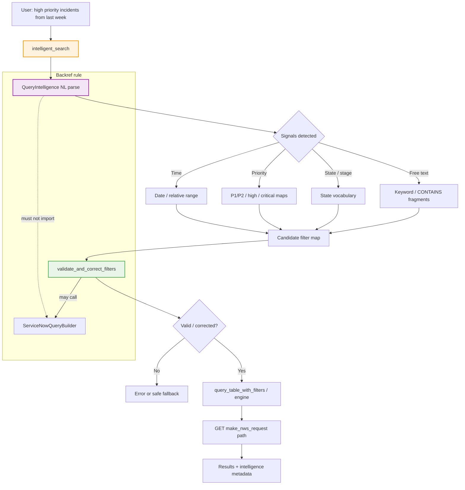
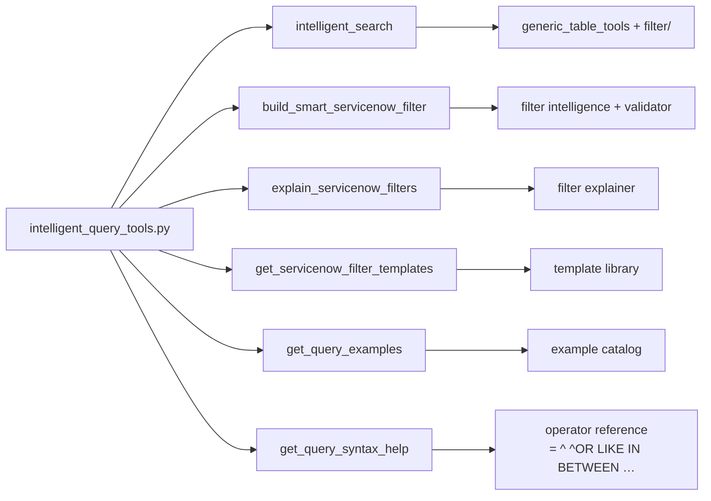
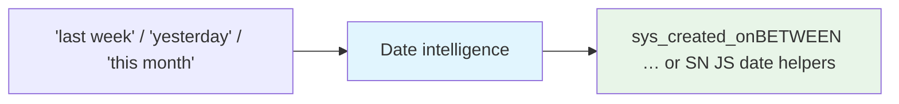
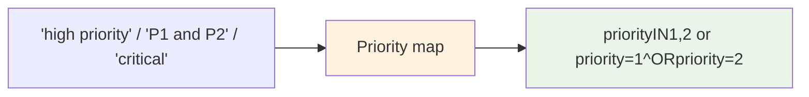
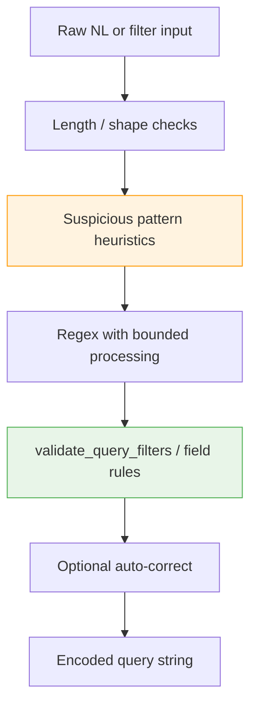

# Natural Language & Filter Intelligence (v4.3)

How conversational queries become ServiceNow encoded queries. This is **regex- and rule-based** NLP in `filter/intelligence.py` — not an external LLM API. MCP tools in `intelligent_query_tools.py` are thin wrappers around the `filter/` package.

## Package responsibilities

| Module | Role |
|--------|------|
| `filter/intelligence.py` | `QueryIntelligence` — NL → filter fragments; confidence; **no** import of builder |
| `filter/validator.py` | Validate + `validate_and_correct_filters` (only place that may call builder from NL path) |
| `filter/builder.py` | `ServiceNowQueryBuilder` — OR / date / exclusion / complete filter strings |
| `filter/explainer.py` | `QueryExplainer` — human-readable explanation, size hints |
| `filter/models.py` | `TableFilterParams`, `QueryValidationResult` |
| `intelligent_query_tools.py` | MCP tools: search, build, explain, templates, examples, syntax help |

## Primary workflow (`intelligent_search`)

```mermaid
flowchart TD
    A["User: high priority incidents from last week"] --> B[intelligent_search]
    B --> C[QueryIntelligence NL parse]
    C --> D{Signals detected}
    D -->|Time| E[Date / relative range]
    D -->|Priority| F[P1/P2 / high / critical maps]
    D -->|State / stage| G[State vocabulary]
    D -->|Free text| H[Keyword / CONTAINS fragments]

    E --> I[Candidate filter map]
    F --> I
    G --> I
    H --> I

    I --> J[validate_and_correct_filters]
    J --> K{Valid / corrected?}
    K -->|No| L[Error or safe fallback]
    K -->|Yes| M[query_table_with_filters / engine]
    M --> N[GET make_nws_request path]
    N --> O[Results + intelligence metadata]

    subgraph "Backref rule"
        C -.->|must not import| BLD[ServiceNowQueryBuilder]
        J -->|may call| BLD
    end

    style B fill:#fff3e0,stroke:#ff9800,stroke-width:2px
    style J fill:#e8f5e8,stroke:#4caf50,stroke-width:2px
    style C fill:#f3e5f5,stroke:#9c27b0,stroke-width:2px
```

## Supporting MCP tools

```mermaid
graph LR
    IQ[intelligent_query_tools.py]
    IQ --> T1[intelligent_search]
    IQ --> T2[build_smart_servicenow_filter]
    IQ --> T3[explain_servicenow_filters]
    IQ --> T4[get_servicenow_filter_templates]
    IQ --> T5[get_query_examples]
    IQ --> T6[get_query_syntax_help]

    T1 --> ENG[generic_table_tools + filter/]
    T2 --> FIL[filter intelligence + validator]
    T3 --> EXP[filter explainer]
    T4 --> TMP[template library]
    T5 --> EX[example catalog]
    T6 --> SYN[operator reference<br/>= ^ ^OR LIKE IN BETWEEN …]
```

- **`get_query_syntax_help`**: reference for encoded-query operators (helps agents construct correct `sysparm_query` fragments).
- **Templates / examples**: curated patterns for common enterprise queries; not a separate ML model.

## Parsing examples

### Relative dates

```mermaid
flowchart LR
    A["'last week' / 'yesterday' / 'this month'"] --> B[Date intelligence]
    B --> C["sys_created_onBETWEEN … or SN JS date helpers"]
    style B fill:#e1f5fe
    style C fill:#e8f5e8
```

### Priority phrases

```mermaid
flowchart LR
    A["'high priority' / 'P1 and P2' / 'critical'"] --> B[Priority map]
    B --> C["priorityIN1,2 or priority=1^ORpriority=2"]
    style B fill:#fff3e0
    style C fill:#e8f5e8
```

## Validation & safety

```mermaid
flowchart TD
    A[Raw NL or filter input] --> B[Length / shape checks]
    B --> C[Suspicious pattern heuristics]
    C --> D[Regex with bounded processing]
    D --> E[validate_query_filters / field rules]
    E --> F[Optional auto-correct]
    F --> G[Encoded query string]

    style E fill:#e8f5e8,stroke:#4caf50
    style C fill:#fff3e0,stroke:#ff9800
```

Goals:

- Keep queries within known operators and field names for the target table
- Avoid pathological regex cost (bounded patterns, no open-ended catastrophic backtracking)
- Prefer auto-correct + lower confidence over silent full-table scans where rules allow

## Intelligence metadata (typical fields)

When the path succeeds, responses may include:

- **Confidence** (0.0–1.0) derived from how many signals matched cleanly
- **Explanation** of the interpreted filters in plain language
- **Encoded query** actually sent (or equivalent)
- **Suggestions** when the query is underspecified (e.g. missing state)

Exact keys depend on the tool and code path; `query_table_intelligently(..., debug=True)` can expose extra debug payload (opt-in, v4.2).

## Fallback behaviour

If NL conversion is empty or low quality, the engine can fall back to **text search** (`query_table_by_text` → OR-combined `short_descriptionLIKE…`), so users still get keyword hits rather than a hard failure.

## Usage sketches

| User intent | Likely tool | What the server does |
|-------------|-------------|----------------------|
| “Critical incidents yesterday” | `intelligent_search` | Priority + date filters on `incident` |
| “Explain this filter string” | `explain_servicenow_filters` | Explainer only, no write |
| “Build filter for unassigned P1” | `build_smart_servicenow_filter` | Map → validate → encoded query |
| “What operators exist?” | `get_query_syntax_help` | Static operator reference |
| “Server outage” free text | `search_records` | Keyword OR-LIKE, no NL layer |

## Relation to other layers

- Execution still goes through **`generic_table_tools`** and **`http_layer`** GET invariants.
- SLA-specific presets live in **`query_slas_by_status`** (see [06-sla-architecture-flow.md](./06-sla-architecture-flow.md)); you can still use intelligent tools on `task_sla` when a free-form filter is needed.
