# 🧠 AI Intelligence & Natural Language Processing Flow

This comprehensive diagram demonstrates the revolutionary AI-powered natural language processing system that transforms conversational queries into precise ServiceNow API calls with confidence scoring and intelligent validation.

## 🚀 Complete AI Intelligence Workflow

```mermaid
flowchart TD
    A[User Query: 'Find high priority incidents from last week'] --> B[🧠 intelligent_search MCP Tool]
    B --> C[🔍 Query Intelligence Engine]
    C --> D[📝 Natural Language Parser]

    D --> E{Query Type Detection}
    E -->|Time-based| F[📅 Date Range Parser]
    E -->|Priority-based| G[🎯 Priority Parser]
    E -->|Status-based| H[📊 Status Parser]
    E -->|Complex| I[🧩 Multi-component Parser]

    F --> J[Date Intelligence:<br/>'last week' → BETWEEN syntax]
    G --> K[Priority Intelligence:<br/>'high priority' → priority=1^ORpriority=2]
    H --> L[Status Intelligence:<br/>'active' → state=1]
    I --> M[Combined Filter Building]

    J --> N[🏗️ Smart Filter Builder]
    K --> N
    L --> N
    M --> N

    N --> O[🛡️ Security Validation]
    O --> P{Input Safety Check}
    P -->|Safe| Q[🔧 ServiceNow Query Construction]
    P -->|Malicious| R[❌ Reject with Security Warning]

    Q --> S[📋 Template Matching]
    S --> T{Template Found?}
    T -->|Yes| U[📄 Apply Enterprise Template]
    T -->|No| V[🎯 Generate Custom Filter]

    U --> W[⚡ Execute Optimized Query]
    V --> W

    W --> X[🔄 Paginated API Request]
    X --> Y[📊 Result Processing]
    Y --> Z[🧠 Intelligence Metadata Generation]

    Z --> AA[📈 Response with Intelligence]
    AA --> AB[Return to User with:<br/>• Results<br/>• Confidence Score<br/>• Explanation<br/>• SQL Equivalent]

    subgraph "🛡️ Security Layer"
        REDOS[ReDoS Protection]
        VALID[Input Validation]
        TIMEOUT[Timeout Protection]

        O --> REDOS
        REDOS --> VALID
        VALID --> TIMEOUT
    end

    subgraph "🧠 AI Intelligence Features"
        CONF[Confidence Scoring]
        EXPL[Query Explanation]
        SQL[SQL Generation]
        SUGGEST[Improvement Suggestions]

        Z --> CONF
        Z --> EXPL
        Z --> SQL
        Z --> SUGGEST
    end

    subgraph "📋 Enterprise Templates"
        TEMP1[High Priority Last Week]
        TEMP2[Unassigned Critical]
        TEMP3[Resolved This Month]
        TEMP4[Active Changes]

        S --> TEMP1
        S --> TEMP2
        S --> TEMP3
        S --> TEMP4
    end

    style B fill:#fff3e0,stroke:#ff9800,stroke-width:3px
    style C fill:#f3e5f5,stroke:#9c27b0,stroke-width:3px
    style O fill:#ffebee,stroke:#f44336,stroke-width:2px
    style AA fill:#e8f5e8,stroke:#4caf50,stroke-width:3px
```



## 🔍 Natural Language Parsing Examples

### Date Intelligence Processing
```mermaid
flowchart LR
    A['"last week"'] --> B[Date Parser]
    B --> C[Calculate Dates:<br/>2025-08-25 to 2025-08-31]
    C --> D["sys_created_onBETWEEN<br/>javascript:gs.beginningOfLastWeek()<br/>@javascript:gs.endOfLastWeek()"]

    E['"August 25-31, 2025"'] --> B
    F['"Week 35 2025"'] --> B
    G['"yesterday"'] --> B

    style B fill:#e1f5fe
    style D fill:#e8f5e8
```

### Priority Intelligence Processing
```mermaid
flowchart LR
    A['"high priority"'] --> B[Priority Parser]
    B --> C[Map to ServiceNow:<br/>P1 = 1, P2 = 2]
    C --> D["priority=1^ORpriority=2"]

    E['"P1,P2"'] --> B
    F['"critical incidents"'] --> B
    G['["1","2","3"]'] --> B

    style B fill:#fff3e0
    style D fill:#e8f5e8
```

## 🛡️ Security & Validation Flow

```mermaid
flowchart TD
    A[User Input] --> B[🔍 Input Length Check]
    B --> C{< 200 chars?}
    C -->|Yes| D[📊 Pattern Analysis]
    C -->|No| E[❌ Reject: Input too long]

    D --> F{Suspicious patterns?}
    F -->|No| G[🧠 Natural Language Processing]
    F -->|Yes| H[⚠️ Security Warning & Safe Processing]

    G --> I[🛡️ ReDoS Protection Check]
    I --> J{Regex safe?}
    J -->|Yes| K[✅ Continue Processing]
    J -->|No| L[❌ Timeout Protection Applied]

    H --> M[🧽 Sanitize Input]
    M --> K

    K --> N[🎯 Query Generation]

    subgraph "🚨 Threat Detection"
        SQL[SQL Injection]
        XSS[XSS Attempts]
        PATH[Path Traversal]
        BUFF[Buffer Overflow]

        F --> SQL
        F --> XSS
        F --> PATH
        F --> BUFF
    end

    style E fill:#ffebee,stroke:#f44336
    style H fill:#fff3e0,stroke:#ff9800
    style K fill:#e8f5e8,stroke:#4caf50
```



## 🧠 Intelligence Generation Process

```mermaid
flowchart TD
    A[Query Execution Complete] --> B[📊 Analyze Query Components]
    B --> C[🎯 Calculate Confidence Score]
    C --> D[💡 Generate Human Explanation]
    D --> E[🔧 Create SQL Equivalent]
    E --> F[📋 Check for Improvements]

    F --> G[📈 Compile Intelligence Metadata]
    G --> H[Intelligence Response:<br/>• Confidence: 0.85<br/>• Explanation: "Found P1/P2 incidents from Aug 25-31"<br/>• SQL: "SELECT * WHERE priority IN (1,2)"<br/>• Suggestions: ["Consider adding state filter"]]

    subgraph "🎯 Confidence Factors"
        CF1[Template Match: +0.3]
        CF2[Date Parsing: +0.2]
        CF3[Priority Parsing: +0.2]
        CF4[Result Count: +0.15]
        CF5[Query Complexity: +0.15]

        C --> CF1
        C --> CF2
        C --> CF3
        C --> CF4
        C --> CF5
    end

    subgraph "💡 Explanation Generation"
        EX1[Identify Key Components]
        EX2[Map to Business Terms]
        EX3[Add Context Information]
        EX4[Include Filter Summary]

        D --> EX1
        D --> EX2
        D --> EX3
        D --> EX4
    end

    style H fill:#e8f5e8,stroke:#4caf50,stroke-width:3px
```

## 📋 Smart Template System

```mermaid
flowchart LR
    A[Query Analysis] --> B{Template Pattern Match}

    B -->|90%+ match| C[📄 High Priority Last Week]
    B -->|85%+ match| D[📄 Unassigned Critical Items]
    B -->|80%+ match| E[📄 Resolved This Month]
    B -->|75%+ match| F[📄 Active Database Issues]
    B -->|<75% match| G[🎯 Custom Filter Generation]

    C --> H[Template Applied:<br/>• priority=1^ORpriority=2<br/>• sys_created_on BETWEEN last week<br/>• Confidence: 0.95]

    D --> I[Template Applied:<br/>• assigned_to=NULL<br/>• priority=1<br/>• state=1<br/>• Confidence: 0.90]

    G --> J[Custom Filter Built:<br/>• Parsed components individually<br/>• Validated syntax<br/>• Confidence: 0.60-0.80]

    subgraph "📚 Enterprise Template Library"
        T1[Common Business Scenarios]
        T2[Technical Issue Patterns]
        T3[Time-based Queries]
        T4[Priority Classifications]
        T5[Status Combinations]
    end

    style H fill:#e8f5e8,stroke:#4caf50
    style I fill:#e1f5fe,stroke:#2196f3
    style J fill:#fff3e0,stroke:#ff9800
```



## ⚡ Performance Optimization Features

### Enhanced Query Processing
- **Compiled Regex Patterns**: 5x faster than SpaCy NLP processing
- **Template Caching**: Pre-built patterns for instant recognition
- **Early Pattern Exit**: Stop processing once high confidence match found
- **Pagination Support**: Handle large result sets efficiently

### Intelligent Caching
- **Template Match Cache**: Remember successful pattern matches
- **Query Result Cache**: Cache recent query results for similar requests
- **OAuth Token Reuse**: 1-hour token expiry with automatic refresh

### Security Performance
- **Input Validation**: Lightning-fast pattern checks before processing
- **ReDoS Protection**: Timeout limits prevent resource exhaustion
- **Safe Regex Engine**: Compiled patterns avoid catastrophic backtracking

## 🎯 Usage Examples

### Example 1: Time-based Query
**Input**: "Show me critical incidents from yesterday"
**AI Processing**:
- Detects time component: "yesterday"
- Detects priority: "critical" → priority=1
- Template match: 85% confidence
- **Output**: 23 P1 incidents with full explanation

### Example 2: Complex Multi-filter
**Input**: "Find unassigned P1 and P2 database incidents from last month"
**AI Processing**:
- Time: "last month" → BETWEEN dates
- Priority: "P1 and P2" → priority=1^ORpriority=2
- Assignment: "unassigned" → assigned_to=NULL
- Category: "database" → keyword search
- **Output**: 8 incidents with 92% confidence

### Example 3: Natural Language with Context
**Input**: "Any high priority changes related to servers this week?"
**AI Processing**:
- Table detection: "changes" → change_request table
- Priority: "high priority" → priority=1^ORpriority=2
- Time: "this week" → current week BETWEEN
- Context: "servers" → text search
- **Output**: 5 change requests with detailed intelligence metadata

---

*This AI Intelligence system represents a revolutionary advancement in ServiceNow query processing, combining enterprise-grade security with human-like natural language understanding.*