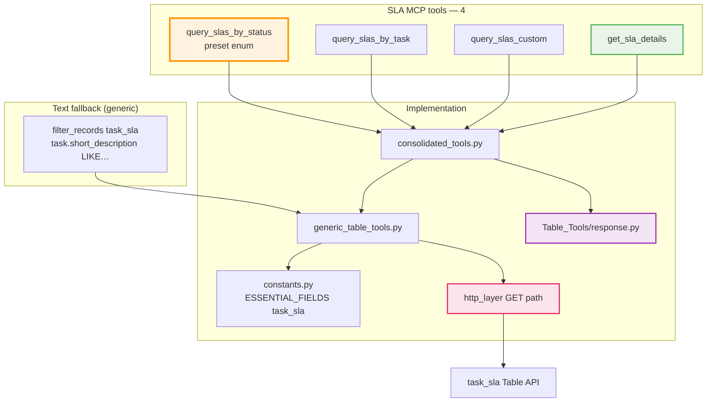
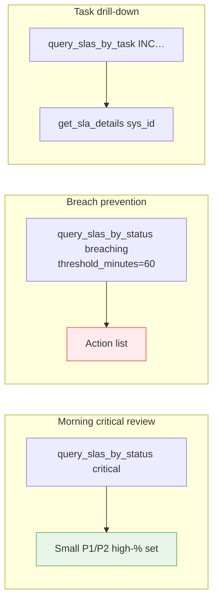
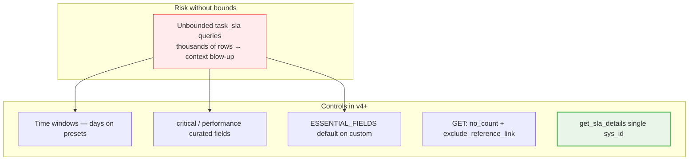

# SLA Architecture (v5.0)

SLA monitoring against the ServiceNow **`task_sla`** table. v4 collapsed **10 tools into 5**; v5.0 removed the broken text-similarity entry point, leaving **4 SLA tools**. Defaults favour small, recent result sets so large instances do not flood the LLM context.

## Tool surface (current)

| Tool | Purpose |
|------|---------|
| `query_slas_by_status(status, …)` | Preset dispatcher (see enum below) |
| `query_slas_by_task(task_number)` | All SLAs for a parent task number |
| `query_slas_custom(filters, fields, days)` | Escape hatch; `fields=None` → `ESSENTIAL_FIELDS["task_sla"]` |
| `get_sla_details(sla_sys_id)` | Single row by **`sys_id=`** (v3 bug fixed) |

> **Removed in v5.0:** `similar_slas_for_text` — it queried a `short_description` field that `task_sla` lacks, so ServiceNow silently returned an arbitrary page. Replacement:  
> `filter_records("task_sla", {"task.short_description": "LIKE…"})`.

### `query_slas_by_status` presets

```text
active | breached | breaching | critical | by_stage | performance
```

| Preset | Intent | Typical constraints |
|--------|--------|---------------------|
| `active` | In-flight SLAs | Active / in-progress style filters |
| `breached` | Already breached | Time window via `days` (+ optional extra filters) |
| `breaching` | About to breach | `threshold_minutes` |
| `critical` | Executive slice | High-priority tasks + high completion % |
| `by_stage` | Stage filter | Requires `stage=` |
| `performance` | Summary-oriented | Curated field list; `days` window |

Unknown `status` → validation error envelope. **`by_stage`** requires the `stage` argument.

## v3 → v4 mapping (for older clients)

| Removed v3 tool | v4+ replacement |
|-----------------|-----------------|
| `get_slas_for_task(num)` | `query_slas_by_task(num)` |
| `get_breaching_slas(mins)` | `query_slas_by_status("breaching", threshold_minutes=mins)` |
| `get_breached_slas(filters, days)` | `query_slas_by_status("breached", days=…, extra_filters=…)` |
| `get_slas_by_stage(stage, filters)` | `query_slas_by_status("by_stage", stage=…, extra_filters=…)` |
| `get_active_slas(filters)` | `query_slas_by_status("active", extra_filters=…)` |
| `get_sla_performance_summary(…)` | `query_slas_by_status("performance", days=…, extra_filters=…)` |
| `get_recent_breached_slas(days)` | `query_slas_by_status("breached", days=…)` |
| `get_critical_sla_status()` | `query_slas_by_status("critical")` |

Unchanged names: `get_sla_details` (behaviour of details fixed — see below).  
v5.0 additionally removed `similar_slas_for_text` (see note above).

### `get_sla_details` bug fix

v3 routed through a path that used `number={sys_id}` on `task_sla` (no `number` field). ServiceNow ignored the filter and returned a full page (~10k rows / huge token cost). v4+ queries **`sys_id={sys_id}`** and returns one record under `{record}`. Details: [MIGRATION_v3_to_v4.md](../MIGRATION_v3_to_v4.md).

## Architecture diagram



## Operational flows (v5 tool names)



## Token optimization strategy



| Control | Where |
|---------|--------|
| Preset defaults | `query_slas_by_status` |
| Field lists | `ESSENTIAL_FIELDS` / detail sets; critical & performance use lean projections |
| Escape hatch still safe by default | `query_slas_custom` does **not** select all columns when `fields` is omitted |
| HTTP GET invariants | `http_layer` (same as other tables) |
| Regression guard | `tests/test_token_footprint.py` (+ HTTP-layer negative tests) |

## Business scenarios (call patterns)

### Daily operations
1. `query_slas_by_status("critical")` — executive attention list  
2. `query_slas_by_status("breaching", threshold_minutes=240)` — early warning  
3. `query_slas_by_status("breached", days=1)` — last day breaches  

### Weekly review
1. `query_slas_by_status("breached", days=7)`  
2. `query_slas_by_status("performance", days=30)`  
3. `query_slas_by_status("by_stage", stage="…", extra_filters=…)`  

### Incident-linked
1. `query_slas_by_task("INC…")`  
2. `get_sla_details("<sys_id>")`  
3. Text on parent task (v5): `filter_records("task_sla", {"task.short_description": "LIKE database"})`  

### Fully custom
`query_slas_custom(filters={…}, fields=[…], days=N)` when no preset fits.

## Table quirks (`task_sla`)

- Uses **`stage`** (not the same as task `state` vocabulary on incidents).
- No reliable **`number`** field for the SLA row itself — identify by **`sys_id`** or via task relationship (`TableSpec.number_field` makes this structural).
- Parent task priority often filtered as `task.priority=…` in presets such as `critical`.
- Parent task text is on **`task.short_description`**, not on the SLA row.

## Design goals

- One obvious tool for “how are we doing?” (`query_slas_by_status`) instead of eight near-duplicates  
- Hard stop on accidental full-table dumps (`get_sla_details`, field defaults)  
- Escape hatch without opening “select *” by default  
- Same OAuth + GET optimization path as the rest of the server  
- §3.1 response envelopes (list / record / error) like every other tool  
