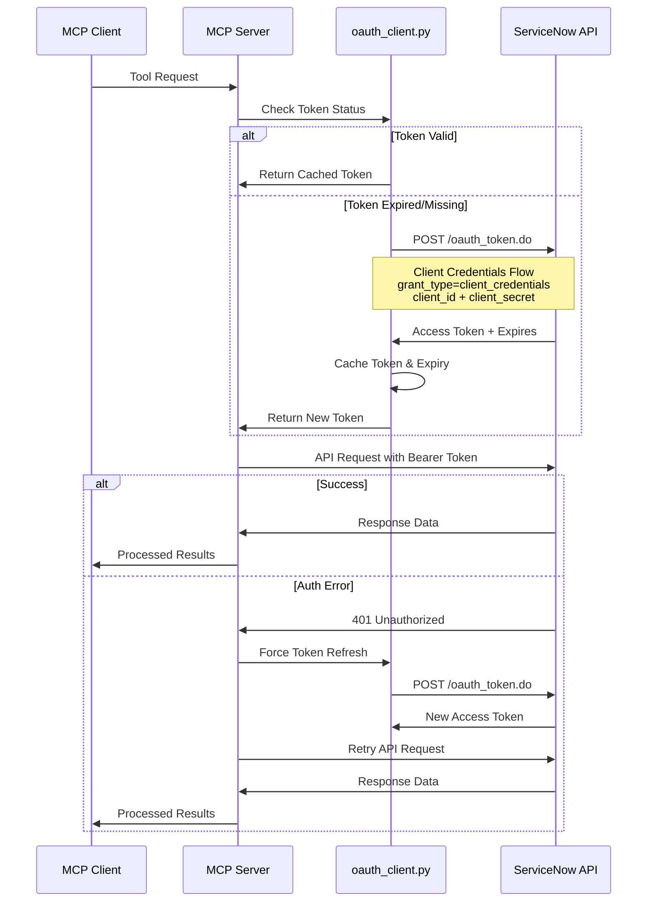

# OAuth 2.0 Authentication Flow

This sequence diagram illustrates how the MCP server handles OAuth 2.0 Client Credentials authentication with ServiceNow, including automatic token management and refresh.

## Authentication Features

- **Client Credentials Flow**: Secure machine-to-machine authentication
- **Automatic Token Management**: Tokens cached until near expiry
- **Thread-Safe Operations**: Async locks prevent concurrent token requests
- **Error Recovery**: Automatic retry on authentication failures
- **Environment Configuration**: Credentials loaded from `.env` file

## Security Benefits

- No hardcoded credentials in source code
- Tokens automatically expire and refresh
- Bearer token authentication (more secure than Basic Auth)
- Encrypted HTTPS communication with ServiceNow